> "To observe processes and to construct means is science; to criticize and coordinate ends is philosophy." [@durant1926]

AI in health is often discussed as if implementation were mainly a technical problem.
Better models, better datasets, better infrastructure, better procurement, better regulation. All of these matter, but I do not think they are the whole story. Implementing AI in health is also an ethical, moral, professional, and epistemic question. It forces us to ask what kind of medicine we are making easier to practise, what kinds of judgment we are formalising, and what kinds of patients and professionals our systems are quietly training us to become. Above all, it asks what we are willing to lose in exchange for speed, scale, and apparent precision.

I am not anti-AI, or a neo-luddite. In some domains, AI will be genuinely useful, and in a few it may be transformative. It can help with narrow diagnostic tasks, image interpretation, documentation support, data synthesis, cohort identification, triage support, and scientific work. It may reduce some forms of drudgery. It may make certain kinds of expertise more available. It may even improve access and consistency when implemented in the right settings. But none of that settles the important question. As Neil Postman put it, every technology is both a blessing and a burden [@postman1992].
We are surrounded by people who can say what a technology will do, but are much less able to say what it will undo. That, to me, is the starting point for thinking about AI in medicine.

## Medicine is not only information processing

One reason I resist purely technical narratives of AI in health is that medicine is not reducible to information processing, even though information is everywhere in it. 
The body is measurable, classifiable, imageable, and recordable. But it is also embodied, temporal, relational, and interpretive. 
Jonathan Reisman, in *The Unseen Body*, describes much of medicine as plumbing: the body as a system of pipes, flows, and blockages [@reisman2021].
That sounds comic at first, but it is a useful corrective. 
A great deal of care begins not in abstraction but in the management of flow, blockage, rhythm, pain, swelling, frailty, breath, blood, and trust.
The body is a living process, not a dashboard.

The older I get, the more I think this matters. Reisman also reminds us that the heart and lungs work in rhythms that clinicians learn to attend to long before they become variables in a model [@reisman2021]. Breathing can be counted, but it is first encountered as cadence, effort, distress, silence, relief. In one of the oldest bodily inscriptions, a Zhou dynasty text describes breath in terms of descent, settling, strength, growth, and return [@nestor2020]. 
The language is premodern, but the intuition is not alien to medicine: health is not just a number captured at a single time point, but an organised pattern of life.

Medicine has always been shaped by the tools and metaphors of its time.
Reisman notes that in medieval Europe physicians were colloquially associated with leeches, and medical books could be called "leechbooks" [@reisman2021]. That anecdote is useful not because we should laugh at the past, but because it reminds us that every era develops its own favoured instruments and then begins to imagine medicine in their image. 
Our version may not be the leech or the lancet, but it may be the template, the dashboard, the classifier, the large language model, or the optimisation engine.

This is why I worry when AI in health is discussed as if the central problem were simply extracting more signal from more data. Data matter enormously. But medicine begins in attention to bodies and persons, not only in optimized prediction. The danger is not that models will measure too much. The danger is that the things models measure well will come to count as the things that matter most.

## The patient is not a score

Postman is especially good on this point. In *Technopoly*, he warns that once a culture becomes accustomed to quantification, it becomes tempted to believe that whatever can be given a number has acquired a more real form of existence [@postman1992]. In health care, that temptation is everywhere. Risk scores, severity indices, throughput metrics, length-of-stay dashboards, compliance reports, quality indicators, patient-reported outcome measures, triage categories, billing codes, and now machine learning outputs: each of these may be useful, but each also invites a subtle conceptual slide. The indicator starts as a proxy; then it begins to function as reality.

This is not a new problem.
The history of medicine is full of episodes where measurement promised more than it could responsibly deliver. 
Adolphe Quetelet and other nineteenth-century statisticians helped create the modern dream that the variability of human life might be made legible, governable, and predictable through numerical regularities [@smil2020]. 
That dream was productive in some ways.
It helped build epidemiology, public health, and modern comparative medicine. But it also carried a permanent risk: legibility can be mistaken for understanding, and regularity for meaning.
Quetelet himself was not unaware of these dangers. His *l'homme moyen* (the average man) was intended as a descriptive and statistical concept, not a normative one. Smil's treatment of Quetelet captures this irony: the father of applied statistics was more self-aware about the limits of his method than many of those who came after him [@smil2020]. The risk was visible from the beginning, which makes it harder to excuse as an unforeseen consequence.

That risk remains with us. 
A probability is not a prognosis in the full human sense. 
A classification is not a judgment. 
A risk score is not a conversation. 
A high-performing model may still be clinically foolish if it is inattentive to context, hard to contest, or deployed into the wrong workflow. 
Postman's warning that "to a man with a computer, everything looks like data" remains painfully relevant [@postman1992]. 
If you spend long enough inside a quantified system, you begin to experience what cannot be easily measured as vague, secondary, or inconvenient.

The patient, however, is not a score. 
A patient is someone whose problem appears in a life. 
That is why the relational side of medicine matters so much. 
Reisman notes that medicine is not only about yes-or-no diagnosis; it also requires meeting patients on a human level and building trust [@reisman2021]. 
In practice, this means that good clinical care often depends on things that are difficult to formalise: hesitation, eye contact, contextual inference, narrative repair, moral seriousness, and the ability to notice when the technically correct answer is not the clinically or humanly sufficient one.

## Better tools can still produce thinner medicine

I think the sturdiest philosophical critique of health AI is not that it will fail technically, but that it may succeed in reorganising medicine around thinner ends. Thoreau's line, that our inventions are *"improved means to an unimproved end"*, feels uncomfortably current.
AI can make many things easier. But easier for what? Easier to document? Easier to bill? Easier to classify? Easier to monitor? Easier to defend? Easier to scale? Those may or may not align with what matters most to medicine.

This is where philosophy is still useful. Science and engineering are excellent at constructing means. They are less able, on their own, to tell us what ends deserve loyalty. 
Durant's distinction between means and ends captures this beautifully [@durant1926]. 

If we do not ask what kind of medicine our tools are serving, then the tools themselves begin to answer the question for us. That is one reason I am drawn to Postman and Cal Newport. They are different writers, but they share a concern for what technologies do to the texture of work and attention. Newport's phrase "busyness as proxy for productivity" could have been written about contemporary health systems [@newport2016]. 
We already live in environments where visible digital activity is too easily mistaken for value: more messages answered, more fields completed, more reminders handled, more documentation corrected, more screens traversed.
Anyone who has used a modern electronic health record system knows how plausible it is for a clinician to become a stressed-out operator of brittle machinery; Kevin Roose describes this condition from a different angle in *Futureproof*, warning against the slow slide from practitioner to machine-minder [@roose2021].
AI can either help reduce that condition or deepen it.

My fear is that, unless we are deliberate, AI will be layered on top of already overloaded bureaucratic systems and will make them feel more intelligent without making them more humane. 
It will automate parts of the burden while preserving the logic of the burden. A bad implementation will not liberate clinicians for better care. It will simply produce new forms of supervision, exception-handling, validation, auditing, and low-grade cognitive fragmentation.

There is a second, related risk. Even when AI succeeds at its stated purpose, it may do so in ways that draw clinical attention toward thinner knowledge. If the system performs well on what it can measure (pattern recognition, risk stratification, documentation), it may gradually shift the epistemic centre of gravity of the encounter toward those tasks, at the expense of the harder, slower, less codifiable work of contextual judgment and therapeutic relationship. This is not a failure of technology; it is a predictable consequence of optimising for what is legible to a model.

## More information does not equal more wisdom

Another of Postman's enduring insights is that information glut does not produce wisdom.
It often produces confusion, superficiality, and the illusion of knowledge [@postman1992; @postman1985].
This matters enormously in health.
AI can synthesise, summarise, prioritise, and predict across bodies of information far larger than any one clinician can hold in mind.
That is a real capability.
But the step from information to knowledge, and from knowledge to wisdom, is not automatic.
Kissinger, Schmidt, and Huttenlocher echo a long-standing distinction (traceable at least to T.S. Eliot's *"Where is the wisdom we have lost in knowledge? / Where is the knowledge we have lost in information?"*): information becomes knowledge when it is contextualised, and knowledge becomes wisdom only when it informs conviction and judgment [@kissinger2021].

One way I have come to organise this for myself is as a stack of four layers, each resting on the one below. The technical layer is what most of the AI conversation talks about: models, data, infrastructure. But a health AI system only earns its place in practice when the layers above it are in order: ethical commitments that set the boundaries of what is acceptable; professional commitments that place the system inside a relationship of judgment and responsibility; and epistemic commitments that keep the whole enterprise humble about what it can know.

```mermaid

graph TB
    subgraph EpL["**Epistemic Layer**"]
        Ep1["Knowledge Integration"] --> Ep2["Wisdom Application"] --> Ep3["Humility in Uncertainty"] --> Ep4["Critical Reflexivity"]
    end
    subgraph PL["**Professional Layer**"]
        P1["Clinical Judgment"] --> P2["Therapeutic Relationship"] --> P3["Responsibility"] --> P4["Contextual Understanding"]
    end
    subgraph EL["**Ethical Layer**"]
        E1["Patient Autonomy"] --> E2["Justice & Equity"] --> E3["Beneficence"] --> E4["Non-maleficence"]
    end
    subgraph TL["**Technical Layer**"]
        T1["Algorithms / Models"] --> T2["Data Infrastructure"] --> T3["Computing Resources"]
    end
    TL -->|grounds| EL
    EL -->|constrains| PL
    PL -->|requires| EpL
    EpL -.->|reshapes| TL

    classDef layerTech   fill:#7A9B9E22,stroke:#7A9B9E,stroke-width:1.5px,color:#2C3E50,rx:6;
    classDef layerEth    fill:#C4A57B22,stroke:#C4A57B,stroke-width:1.5px,color:#2C3E50,rx:6;
    classDef layerProf   fill:#2C3E5014,stroke:#2C3E50,stroke-width:1.5px,color:#2C3E50,rx:6;
    classDef layerEpist  fill:#8B7B6B22,stroke:#8B7B6B,stroke-width:1.5px,color:#2C3E50,rx:6;
    classDef node        fill:#ffffff,stroke:#2C3E50,stroke-width:1px,color:#2C3E50,font-size:12px,rx:4;

    class TL layerTech
    class EL layerEth
    class PL layerProf
    class EpL layerEpist
    class T1,T2,T3,E1,E2,E3,E4,P1,P2,P3,P4,Ep1,Ep2,Ep3,Ep4 node
```

The diagram is not a hierarchy of importance; it is a hierarchy of constraint. A technical system can be excellent on its own terms and still be wrong to deploy if the ethical, professional, and epistemic layers have not been worked through. The feedback arrow matters too: what the epistemic layer learns (where the model fails, which patients it serves poorly, which claims it cannot yet support) has to change the technical layer, or the whole stack quietly ossifies.

It is tempting to imagine that enough data plus enough computation will overcome the messiness of medicine.
But this is a category mistake. 
The messiness is not a temporary obstacle that better engineering will eliminate. It is partly what medicine is. 
Patients are not standardised inputs. They arrive late, frail, frightened, contradictory, culturally situated, and often uncertain about what matters most to them. A technical system that performs well in abstraction may still distort the priorities of a clinical encounter by putting the weight of reality behind what it can see most easily.

## Skepticism should be part of implementation

If I had to name one intellectual habit that should be mandatory in AI implementation, it would be skepticism in the best sense: not cynicism, but disciplined doubt.
The key move is not to look only for evidence that confirms our hypothesis, but to try to prove it wrong [@novella2018]. 
That should be part of the culture of health AI.

Too much AI discourse in medicine still resembles what the skeptic tradition calls "Tooth Fairy science", a term coined by Harriet Hall and popularised by Novella [@novella2018]: refining measurements around a phenomenon without answering the deeper question of whether the phenomenon has been properly understood in the first place. In health AI, this means we can endlessly improve a model's AUC, calibration, or throughput while failing to ask whether the model's framing of the clinical question is itself sound: whether we are counting the right things, in the right way, for the right people. Does this improve care? For whom? In what setting? At what cost? Under what supervision? With what failure modes? Compared to what realistic alternative?

Medical history offers many warnings here. Novella describes Albert Abrams's early twentieth-century "Dynamizer," a black box that supposedly diagnosed disease through radio waves, followed by another machine that claimed to treat illness with the same mysterious force [@novella2018]. 
The details are absurd, but the pattern is not. 
New technologies acquire authority very easily in medicine, especially when they are opaque, mathematically impressive, or culturally associated with the frontier of science. 
This is one reason I think epistemic humility is not optional. Novelty is not evidence. Complexity is not wisdom. Fluency is not understanding.

This is especially important for generative AI. One of the most useful recent reminders comes from *The Age of AI*: an AI is not sentient, and it does not know what it does not know [@kissinger2021]. 
In clinical settings, that matters a great deal. 
A system that generates fluent language may create the impression of understanding while merely performing statistical completion. The risk is not only factual error. The risk is misplaced confidence, especially when the output is persuasive, concise, and delivered in the aesthetic register of expertise.

Good implementation therefore requires more than procurement and governance documents. It requires a real evaluation culture: external validation, context-specific testing, prospective monitoring, auditability, challenge mechanisms, and the practical possibility of refusing or overruling the system. In health, human-in-the-loop should not be a decorative phrase. It should mean that a named person remains answerable for the judgment, and that the system is there to support rather than to dissolve responsibility.

## The kind of clinician a system encourages

One of my strongest intuitions is that technologies do not only change what we can do; they change what kinds of selves are easier to become. That is true of AI too. Newport argues that we need a philosophy of technology use rooted in deep values, not just a running list of tools [@newport2019]. I think medicine needs the same. The question is not whether to use AI or not. The question is what philosophy of medical work should govern its use.

I want systems that protect concentration rather than colonise it. I want systems that reduce low-value clerical burden rather than turning clinicians into supervisors of brittle administrative machinery. I want systems that help identify meaningful abnormalities without teaching us to ignore ambiguity. I want systems that make room for better decisions, not just faster throughput. I want systems that respect the fact that clinicians are at their best, as Newport puts it, when immersed deeply in something challenging [@newport2016]. Good medicine often depends on precisely that kind of depth.

This is also why I am wary of the language of frictionless health care. Some friction is bad and should be removed. Repetitive clicks, redundant forms, pointless alerts, interface clutter, inaccessible records: these are genuine burdens. But not all friction is waste. Some forms of slowness are constitutive of judgment. Deliberation, explanation, second thoughts, ethical discomfort, reflective pause, and attentive listening are not system inefficiencies. They are part of how medicine avoids becoming merely technical.

Postman has another warning here that I find difficult to shake: standardised forms can destroy nuance by forcing singular situations into prearranged categories [@postman1992]. This is one of the oldest frustrations of bureaucratic medicine, and AI may intensify it if we are careless. An implementation succeeds, in my view, only if it helps clinicians see more clearly without forcing patients to become thinner versions of themselves in order to fit the system.

## What I would want to preserve

So if I try to state my position simply, it is this: I want AI in health to be implemented in ways that preserve context, judgment, responsibility, attention, and trust.

I want data infrastructures that improve access to high-quality clinical data while acknowledging that more information can still mean less understanding [@kissinger2021; @postman1992]. I want evaluation standards that reward real-world usefulness, not just elegant technical performance. I want clinical systems that remain contestable and auditable. I want professional education that includes statistics, bias, regulation, and philosophy of technology, not only prompt engineering or tool use. I want health AI to be governed in a way that includes clinicians, patients, and public institutions, not only vendors and administrators. The EU AI Act [@aiact2024], the European Health Data Space [@ehds2025], and the WHO's 2021 ethics and governance guidance [@who2021] are early steps in this direction, provided the clinicians, patients, and public institutions they invoke remain in the conversation, not only the vendors and administrators.

Most of all, I want to keep clear what medicine is for. Frankl's remark that success should not be directly pursued, but must ensue from dedication to a cause greater than oneself, is a useful corrective here [@frankl1946]. In medicine, that cause is not optimisation for its own sake. It is care. It is relief of suffering, trustworthy judgment under uncertainty, fair access, and the difficult work of helping particular people in particular situations.

If AI helps us do that, I welcome it. If it helps us only look more advanced while making clinical work thinner, noisier, and less humane, then we should be much more cautious than current enthusiasm sometimes allows. The point is not to reject technology. The point is to refuse the idea that technological sophistication is, by itself, a sufficient account of progress.

For me, then, implementing AI in health is not ultimately about building a more automated medicine. It is about deciding what kind of medicine should remain worth practicing.

## Related notes

- [Evaluation methods in health informatics](/notes/emhi/): the reading list I teach from, with reporting-guideline, ethics, and governance references that operationalise many of the concerns raised here.
- [A practical guide to scientific writing for early-career researchers](/notes/sw/): the reporting-standards and AI-disclosure material that the "contestable and auditable" paragraph above depends on in practice.
- [A local RAG chatbot for Moby-Dick](/notes/moby-rag/): a small, inspectable example of the "keep it local and legible" stance applied to a real LLM workflow; the same pattern extends to clinical guidelines and thesis corpora.
- [OpenCode: an AI research assistant in your terminal](/notes/opencode/): the practical end of the same question, with free and local-first model options.

If you have any comments or questions, feel free to [reach out](mailto:tiagojacinto@med.up.pt).
