> [!note]
**This note has been superseded.** [*The Working Draft*](https://tiagojct.eu/working-draft/) is the current, maintained version of this content — expanded chapters, paired-pitfalls treatment, and cross-references to the writing material. This page is kept for archival purposes.

A figure is the only part of your paper that a tired reviewer is guaranteed to read. They may skim the methods, scan the results, and bookmark the discussion for later, but they will look at every figure you draw. This makes the figure the part of the paper that has to do the most work per square centimetre. A clear chart can carry a modestly written paper. A confused chart can sink a careful one.

Good data visualisation is a set of decisions taken with discipline, the same discipline that produces clear prose. Edward Tufte stated the rule plainly: maximise the data-to-ink ratio [@tufte2001visual]. Erase what does not earn its place. Claus Wilke gave us a practical taxonomy of failure [@wilke2019fundamentals], *ugly*, *bad*, *wrong*, *good*, that turns the rule into a checklist for revision.

This note is a primer for early-career health researchers, written as a companion to my [scientific writing guide](/notes/sw/). Where that piece focused on words, this one focuses on the images that sit between them. Every example below uses a fictional hypertension cohort of 600 patients, simulated for this note alone. Code is shown in both R (with the `pequod` package on CRAN) and Python (`seaborn` + `pequod[plot]`). Both use the [Pequod palette](/projects/pequod/): warm paper at one end, deep ink at the other, eight muted accents in between.

> [!tip]
## The short version

If you only take away seven things:

1. A chart is a sentence. Decide what it says before you draw it.
2. Position on a common scale beats every other encoding. Bar before pie. Dot before donut. Length before angle [@cleveland1984graphical].
3. Sequential data deserves a sequential ramp. No rainbows.
4. Zero-anchor your y-axis when bars encode magnitude. Truncated bars exaggerate small differences [@tufte2001visual].
5. Show the data, not its mean. Box plots, strip plots, violins, but not bars-with-error-whiskers [@weissgerber2015beyond].
6. Small multiples beat one busy panel. A second axis almost never beats a second panel.
7. Captions complete the figure. A reviewer should understand the chart from the caption alone.

## The audience is the reviewer

The figure has to survive an unfair amount of attention from a rushed reader, not the careful one you wish you had. A chart that requires squinting, or a legend that needs the methods to be opened in another tab, has already lost.

Two consequences. The figure must be self-sufficient: title, axes, units, sample size, legend, and any abbreviations the reader needs are on the chart, not waiting for the caption. And it must be redundant on purpose: colour, position, label, and shape often encode the same thing, and that overlap is what keeps the figure readable when one channel breaks. About 8 % of men have red-green colour-vision deficiency [@birch2012diagnosis], and they will navigate by shape and label long before they navigate by hue.

The full Pequod design rationale, including a colour-vision-deficiency report (Viénot–Brettel–Mollon simulation [@vienot1999digital] across protanopia, deuteranopia, and tritanopia), is at [tiagojct.eu/projects/pequod/](/projects/pequod/).

## Wilke's taxonomy

Wilke distinguishes four ways a chart can fail [@wilke2019fundamentals].

An *ugly* chart has aesthetic problems but the data is correct: a rainbow palette on a continuous variable, default `ggplot` grey, lowercase axis labels, no units. A *bad* chart has the right data but a poor encoding: a pie of seven categories, a dual-axis line chart, a bar chart where a strip plot belonged. A *wrong* chart is mathematically incorrect: a truncated y-axis on a bar plot, stacked percentages adding to 102, a 3D pie that distorts the slices it depicts. A *good* chart is none of the above: it says what it says, plainly and accurately.

The categories overlap. A figure can be ugly and good at once, or bad and wrong at once. The point of the taxonomy is that all three failures should be ruled out actively, in revision, rather than discovered by a reviewer.

## The cohort

Every example below uses the same simulated dataset: 600 adults with treated hypertension, randomised across four arms (Placebo / ACEi / ARB / CCB), followed for six months.

| Variable             | Type        | Notes                                          |
|----------------------|-------------|------------------------------------------------|
| `id`                 | int         | 1..600                                         |
| `age`                | num         | mean 58, SD 12, clipped to [30, 85]            |
| `sex`                | factor      | F / M                                          |
| `region`             | factor      | North / Centre / South / Islands               |
| `bmi`                | num         | mean 28, SD 4.5                                |
| `comorbidities`      | int         | Poisson, λ ≈ 1.2                               |
| `treatment`          | factor      | Placebo / ACEi / ARB / CCB                     |
| `sbp_baseline`       | num         | mean 148, SD 16 (mmHg)                         |
| `sbp_6m`             | num         | baseline minus a treatment-specific shift      |
| `dbp_baseline`       | num         | mean 90, SD 10 (mmHg)                          |
| `dbp_6m`             | num         | baseline minus a treatment-specific shift      |
| `controlled_6m`      | logical     | `sbp_6m < 140 & dbp_6m < 90`                   |
| `bp_class_6m`        | factor      | Normal / Pre-HT / Stage 1 / Stage 2            |

The full generator is committed alongside this note as [`_generate.R`](_generate.R). It produces the figures shown below and exports the dataset to [`figures/cohort.csv`](figures/cohort.csv) so the Python tabs are reproducible from the same data.

> [!note]
## How the cohort is built (R)

```r
library(dplyr); library(tidyr)
set.seed(11)
n <- 600

cohort <- tibble(
  id  = seq_len(n),
  age = pmin(85, pmax(30, round(rnorm(n, 58, 12)))),
  sex = factor(sample(c("F","M"), n, replace = TRUE, prob = c(0.55, 0.45))),
  treatment = factor(sample(c("Placebo","ACEi","ARB","CCB"), n, replace = TRUE,
                            prob = c(0.20, 0.30, 0.25, 0.25)),
                     levels = c("Placebo","ACEi","ARB","CCB")),
  sbp_baseline = pmin(200, pmax(120, round(rnorm(n, 148, 16)))),
  dbp_baseline = pmin(120, pmax(70,  round(rnorm(n,  90, 10))))
)

trt_shift_sbp <- c(Placebo = 3, ACEi = 14, ARB = 12, CCB = 11)
trt_shift_dbp <- c(Placebo = 1, ACEi =  8, ARB =  7, CCB =  6)

cohort <- cohort |>
  mutate(
    sbp_6m = round(sbp_baseline - trt_shift_sbp[treatment] + rnorm(n, 0, 6)),
    dbp_6m = round(dbp_baseline - trt_shift_dbp[treatment] + rnorm(n, 0, 4)),
    controlled_6m = sbp_6m < 140 & dbp_6m < 90
  )
```

## Common chart types

Before diagnosing what can go wrong, it helps to be clear on the toolkit. Six chart types cover most figures in clinical and epidemiological research. Each one earns its place when the data shape and the message line up. Code is collapsed under each example; full R and seaborn source for every figure in this note lives in [`_generate.R`](_generate.R).

### Histogram and density: one variable's distribution

A histogram bins a single continuous variable into ranges and draws the count (or density) of observations per bin. The bin width is the only knob, and it changes the chart's character: too narrow, and the histogram becomes noisy; too wide, and meaningful structure (bimodality, a clipped lower limit) gets erased. Pair the histogram with a kernel density estimate, as in @fig-type-histogram, to keep both the discrete and the smoothed silhouette visible. Use it for any continuous variable in your cohort: age, BMI, lab values, biomarkers. Watch for clipped distributions (an assay's lower limit of detection appearing as a spike) and right-skew (HbA1c, NT-proBNP, CRP), where a log-x axis is often more honest.

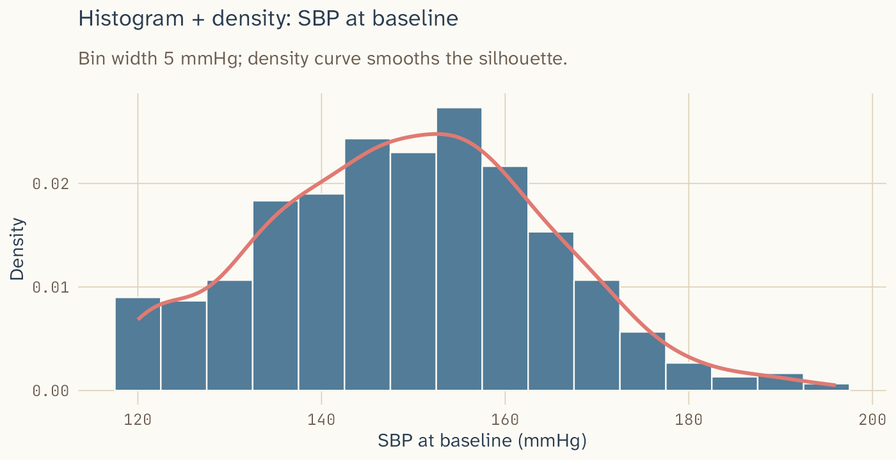{#fig-type-histogram}

> [!note]
## Code

#### R

```r
library(ggplot2); library(pequod)

ggplot(cohort, aes(sbp_baseline)) +
  geom_histogram(aes(y = after_stat(density)),
                 binwidth = 5,
                 fill = pequod_crew_light[["Starbuck"]],
                 colour = "white", linewidth = 0.4) +
  geom_density(colour = pequod_crew_dark[["Ahab"]], linewidth = 1.0) +
  labs(x = "SBP at baseline (mmHg)", y = "Density") +
  theme_minimal(base_family = "Atkinson Hyperlegible Next")
```

#### Python

```python
import seaborn as sns
import matplotlib.pyplot as plt
import pequod

fig, ax = plt.subplots(figsize=(6.4, 3.6))
sns.histplot(data=cohort, x="sbp_baseline", binwidth=5,
             stat="density", color=pequod.CREW_LIGHT["Starbuck"],
             edgecolor="white", ax=ax)
sns.kdeplot(data=cohort, x="sbp_baseline",
            color=pequod.CREW_DARK["Ahab"], linewidth=2, ax=ax)
ax.set(xlabel="SBP at baseline (mmHg)", ylabel="Density")
sns.despine(); fig.tight_layout()
```

### Boxplot, strip plot, and violin: distribution by group

A boxplot summarises a distribution as five numbers: median, quartiles, whiskers. A strip plot shows every observation as a jittered dot. A violin plot shows the kernel density mirrored around a vertical axis. Layered together, as in @fig-type-distribution, they cover the full vocabulary: median for the centre, IQR for the spread, individual points for outliers and sample size, and the violin's silhouette for shape. For small groups (n < 30), drop the box and just show the points; the percentile machinery is unstable. Use this combination for comparing the distribution of a continuous variable across two or more groups. The temptation to replace the whole layered chart with a bar of means and an error whisker is the failure mode in @fig-meanbar.

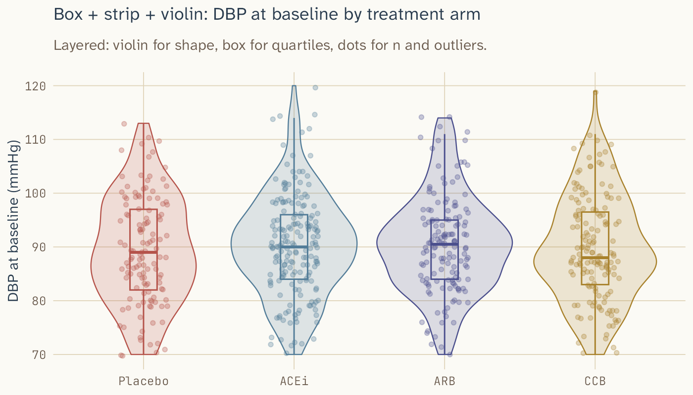{#fig-type-distribution}

> [!note]
## Code

#### R

```r
library(ggplot2); library(pequod)

ggplot(cohort, aes(treatment, dbp_baseline,
                   colour = treatment, fill = treatment)) +
  geom_violin(alpha = 0.18, linewidth = 0.4) +
  geom_jitter(width = 0.16, alpha = 0.30, size = 1.3) +
  geom_boxplot(width = 0.18, fill = NA, outlier.shape = NA, linewidth = 0.5) +
  scale_colour_pequod_d(palette = "crew") +
  scale_fill_pequod_d(palette = "crew") +
  labs(x = NULL, y = "DBP at baseline (mmHg)") +
  theme_minimal(base_family = "Atkinson Hyperlegible Next") +
  theme(legend.position = "none")
```

#### Python

```python
import seaborn as sns
import matplotlib.pyplot as plt
import pequod

crew = list(pequod.CREW_DARK.values())[:4]

fig, ax = plt.subplots(figsize=(6.4, 4))
sns.violinplot(data=cohort, x="treatment", y="dbp_baseline",
               palette=crew, fill=False, linewidth=0.6, ax=ax)
sns.stripplot(data=cohort, x="treatment", y="dbp_baseline",
              palette=crew, alpha=0.30, jitter=0.16, size=3, ax=ax)
sns.boxplot(data=cohort, x="treatment", y="dbp_baseline",
            palette=crew, showfliers=False, fill=False,
            width=0.18, ax=ax)
ax.set(xlabel=None, ylabel="DBP at baseline (mmHg)")
sns.despine(); fig.tight_layout()
```

### Scatter plot: two continuous variables

A scatter plot puts two continuous variables on the two axes and one dot per observation. Every point is its own evidence; the chart is the most direct depiction of a bivariate relationship in statistics. A regression line with a confidence ribbon, as in @fig-type-scatter, summarises the trend without erasing the underlying spread; a third variable can be encoded with colour or shape. Use scatter for any pair of continuous variables: SBP versus DBP, age versus a lab value, dose versus response. The failure mode at large n is overplotting; alpha transparency, hex-binning (`geom_hex`), or 2D density contours all help.

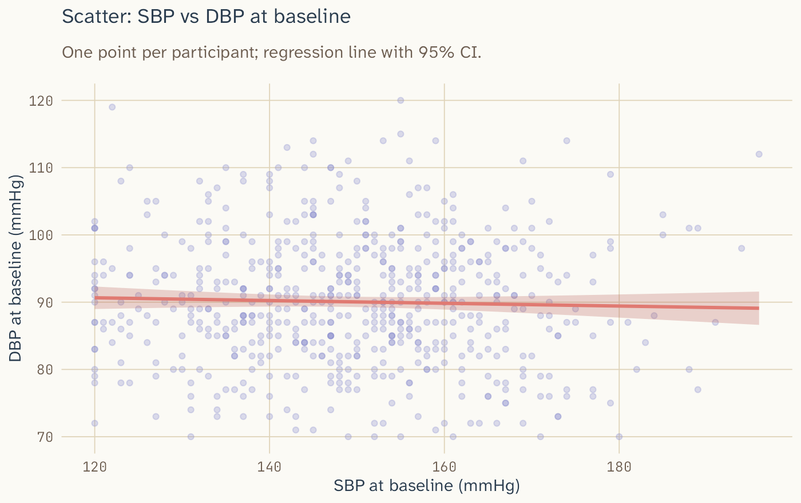{#fig-type-scatter}

> [!note]
## Code

#### R

```r
library(ggplot2); library(pequod)

ggplot(cohort, aes(sbp_baseline, dbp_baseline)) +
  geom_point(alpha = 0.30, colour = pequod_crew_dark[["Queequeg"]],
             size = 1.4) +
  geom_smooth(method = "lm", se = TRUE,
              colour = pequod_crew_dark[["Ahab"]],
              fill   = pequod_crew_light[["Ahab"]], alpha = 0.25) +
  labs(x = "SBP at baseline (mmHg)", y = "DBP at baseline (mmHg)") +
  theme_minimal(base_family = "Atkinson Hyperlegible Next")
```

#### Python

```python
import seaborn as sns
import matplotlib.pyplot as plt
import pequod

fig, ax = plt.subplots(figsize=(6.4, 4.4))
sns.regplot(data=cohort, x="sbp_baseline", y="dbp_baseline",
            scatter_kws=dict(alpha=0.30, color=pequod.CREW_DARK["Queequeg"], s=14),
            line_kws=dict(color=pequod.CREW_DARK["Ahab"], linewidth=2),
            ax=ax)
ax.set(xlabel="SBP at baseline (mmHg)", ylabel="DBP at baseline (mmHg)")
sns.despine(); fig.tight_layout()
```

### Line plot: change over an ordered axis

A line plot connects points across an ordered x-axis (usually time, visit, or dose) so that the trajectory itself is the visual unit. Where a scatter or bar tells you "where", a line tells you "where, then where, then where", and the eye reads the slope pre-attentively. @fig-type-line shows the mean SBP per arm across the four study visits. Use line plots for longitudinal cohort means, time series of an outcome by group, and dose-response curves. The two failure modes have their own pairs in this note: too many lines on one panel (the spaghetti pitfall, @fig-spaghetti) and the two-axis trap (@fig-dualaxis).

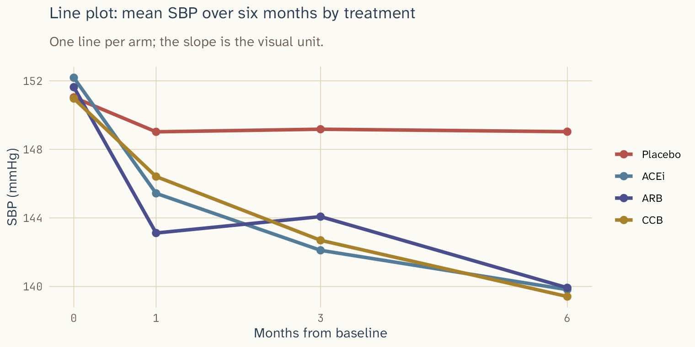{#fig-type-line}

> [!note]
## Code

#### R

```r
library(ggplot2); library(pequod); library(dplyr)

# `traj_summary` has columns: treatment, month, sbp (mean per group/visit)
ggplot(traj_summary, aes(month, sbp, colour = treatment)) +
  geom_line(linewidth = 1.3) +
  geom_point(size = 2.4) +
  scale_colour_pequod_d(palette = "crew") +
  scale_x_continuous(breaks = c(0, 1, 3, 6)) +
  labs(x = "Months from baseline", y = "SBP (mmHg)", colour = NULL) +
  theme_minimal(base_family = "Atkinson Hyperlegible Next")
```

#### Python

```python
import seaborn as sns
import matplotlib.pyplot as plt
import pequod

crew = list(pequod.CREW_DARK.values())[:4]

fig, ax = plt.subplots(figsize=(7.2, 4))
sns.lineplot(data=traj_summary, x="month", y="sbp",
             hue="treatment", palette=crew,
             marker="o", linewidth=2, ax=ax)
ax.set(xlabel="Months from baseline", ylabel="SBP (mmHg)")
ax.set_xticks([0, 1, 3, 6])
sns.despine(); fig.tight_layout()
```

### Forest plot: effect sizes with confidence

A forest plot puts one effect-size estimate per row, each with its 95 % confidence interval drawn as a horizontal whisker. The reader sees the point estimate and its precision in a single glance, and a vertical reference line at zero (or 1 for ratios) does the rhetorical work of "is this difference compatible with no effect?". @fig-type-forest shows the effect of each active arm versus placebo on six-month SBP change. Forest plots are central to clinical research: subgroup analyses, regression coefficients, and meta-analyses all live in this format. Watch for stretched x-axes that make small effects look substantial, and report the test statistic alongside the interval.

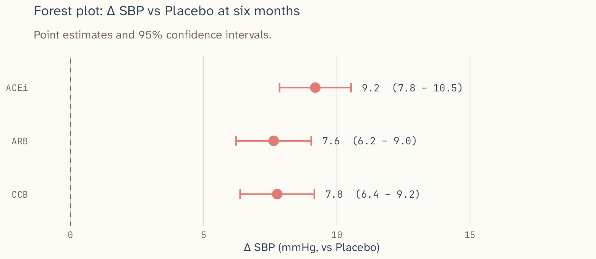{#fig-type-forest}

> [!note]
## Code

#### R

```r
library(ggplot2); library(pequod)

fit_lm <- lm(delta_sbp ~ treatment, data = cohort)
ci <- confint(fit_lm)
co <- coef(fit_lm)
forest_data <- data.frame(
  arm      = sub("^treatment", "", names(co)[-1]),
  estimate = unname(co[-1]),
  lo       = ci[-1, 1],
  hi       = ci[-1, 2]
) |>
  transform(arm = factor(arm, levels = rev(c("ACEi", "ARB", "CCB"))))

ggplot(forest_data, aes(estimate, arm)) +
  geom_vline(xintercept = 0, linetype = "dashed") +
  geom_errorbar(aes(xmin = lo, xmax = hi), width = 0.18,
                colour = pequod_crew_dark[["Ahab"]],
                orientation = "y") +
  geom_point(colour = pequod_crew_dark[["Ahab"]], size = 4) +
  geom_text(aes(x = hi, label = sprintf("%.1f  (%.1f – %.1f)",
                                        estimate, lo, hi)),
            hjust = 0, nudge_x = 0.4, family = "JetBrains Mono", size = 3.3) +
  labs(x = "Δ SBP (mmHg, vs Placebo)", y = NULL) +
  theme_minimal(base_family = "Atkinson Hyperlegible Next")
```

#### Python

```python
import statsmodels.formula.api as smf
import seaborn as sns
import matplotlib.pyplot as plt
import pequod

fit = smf.ols("delta_sbp ~ C(treatment, Treatment(reference='Placebo'))",
              data=cohort).fit()
ci = fit.conf_int().rename(columns={0: "lo", 1: "hi"})
forest = (fit.params.to_frame("estimate")
              .join(ci).reset_index().rename(columns={"index": "term"}))
forest = forest[forest["term"].str.contains("T.")]
forest["arm"] = forest["term"].str.extract(r"T\.([A-Za-z]+)")
forest = forest.set_index("arm").loc[["ACEi", "ARB", "CCB"]].reset_index()

fig, ax = plt.subplots(figsize=(7.2, 3.2))
ax.axvline(0, color="grey", linestyle="--")
ax.errorbar(x=forest["estimate"], y=forest["arm"],
            xerr=[forest["estimate"] - forest["lo"],
                  forest["hi"]      - forest["estimate"]],
            fmt="o", color=pequod.CREW_DARK["Ahab"],
            ms=10, capsize=4)
for _, r in forest.iterrows():
    ax.text(r["hi"] + 0.4, r["arm"],
            f'{r["estimate"]:.1f}  ({r["lo"]:.1f} – {r["hi"]:.1f})',
            va="center", family="JetBrains Mono")
ax.set(xlabel="Δ SBP (mmHg, vs Placebo)", ylabel=None)
sns.despine(); fig.tight_layout()
```

### Kaplan–Meier curve: time to event

A Kaplan–Meier curve plots the proportion of the cohort still event-free over time, dropping in steps as events occur. Censoring (loss to follow-up) is shown by tick marks. Two or more groups can be overlaid for direct comparison of survival or event-free trajectories. @fig-type-km shows time to BP control across the four arms, computed via `survival::survfit()` with synthetic event times. Use it for time-to-event outcomes: death, hospitalisation, recurrence, or any "first time the outcome happened" measure. The classic missing element in published KM plots is the *number-at-risk* table below the x-axis; without it, the visual confidence in the right-hand tail can far exceed the actual sample size.

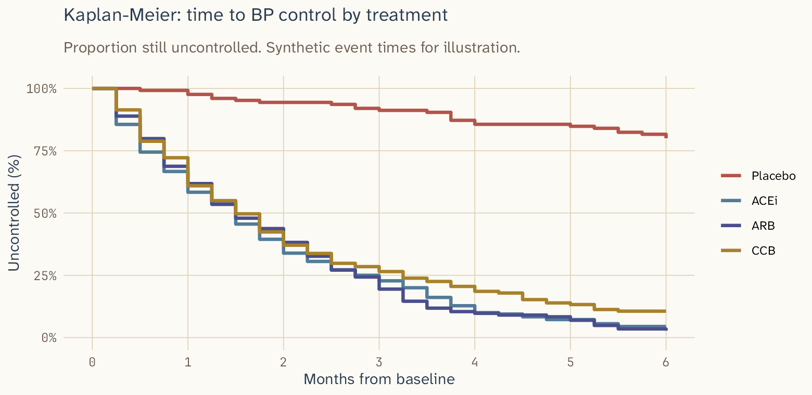{#fig-type-km}

> [!note]
## Code

#### R

```r
library(ggplot2); library(pequod); library(survival); library(dplyr)

# cohort_km has: treatment, event_time (months), event (0/1)
fit  <- survfit(Surv(event_time, event) ~ treatment, data = cohort_km)
sfit <- summary(fit, times = seq(0, 6, by = 0.25), extend = TRUE)

km_df <- data.frame(
  time      = sfit$time,
  surv      = sfit$surv,
  treatment = factor(gsub("treatment=", "", as.character(sfit$strata)),
                     levels = c("Placebo", "ACEi", "ARB", "CCB"))
)

ggplot(km_df, aes(time, surv, colour = treatment)) +
  geom_step(linewidth = 1.1) +
  scale_colour_pequod_d(palette = "crew") +
  scale_y_continuous(labels = scales::percent_format(), limits = c(0, 1)) +
  scale_x_continuous(breaks = 0:6) +
  labs(x = "Months from baseline", y = "Uncontrolled (%)", colour = NULL) +
  theme_minimal(base_family = "Atkinson Hyperlegible Next")
```

#### Python

```python
import seaborn as sns
import matplotlib.pyplot as plt
import pequod
from lifelines import KaplanMeierFitter

crew = list(pequod.CREW_DARK.values())[:4]

fig, ax = plt.subplots(figsize=(7.2, 4))
for arm, colour in zip(["Placebo", "ACEi", "ARB", "CCB"], crew):
    sub = cohort_km[cohort_km["treatment"] == arm]
    KaplanMeierFitter().fit(sub["event_time"], sub["event"], label=arm) \
        .plot_survival_function(ax=ax, color=colour, ci_show=False)
ax.set(xlabel="Months from baseline", ylabel="Uncontrolled (%)")
ax.set_yticks([0, 0.25, 0.5, 0.75, 1.0])
ax.set_yticklabels(["0%", "25%", "50%", "75%", "100%"])
sns.despine(); fig.tight_layout()
```

## Seven paired pitfalls

With the toolkit in hand, the next move is to know how each tool fails. Each pair below shows the same data drawn two ways: a *bad / ugly / wrong* version, then a *good* version. Code is hidden by default and lives in a collapsible block under each pair, with R and Python tabs. The R code is what actually generated the PNG; the Python (seaborn) code is a deliberate translation that reaches the same figure from the same `cohort.csv`.

### 1. Pie chart → ordered horizontal bar

The pie chart is the bad chart most often defended in health research. The eye is poor at angle judgement, and slices that differ by only a few percentage points are nearly indistinguishable. A horizontal bar chart ordered by frequency replaces angle judgement with position on a common scale, the strongest visual encoding available [@cleveland1984graphical]. Compare @fig-pie with @fig-bar.

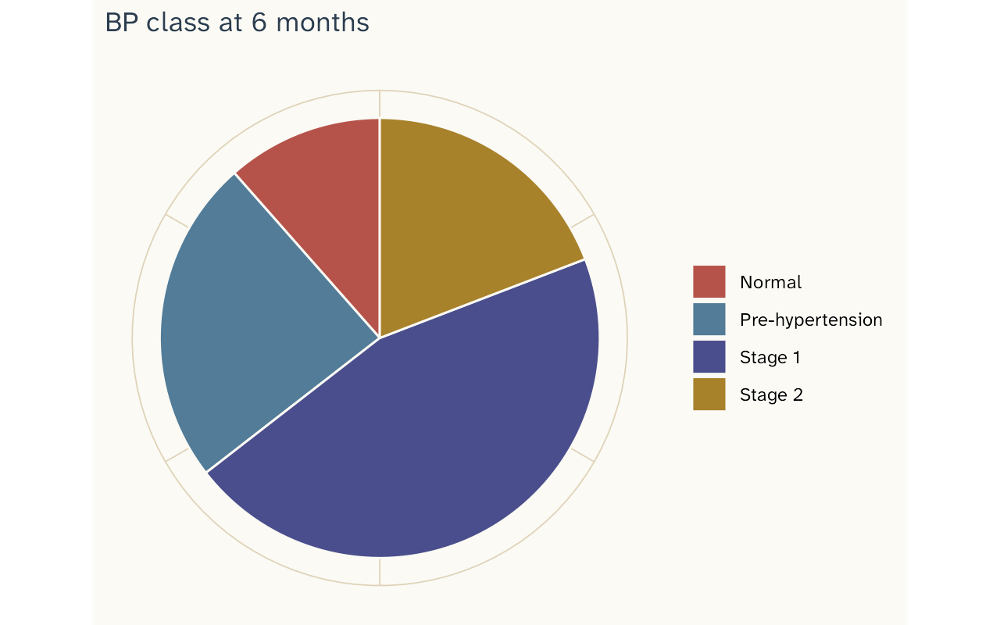{#fig-pie}

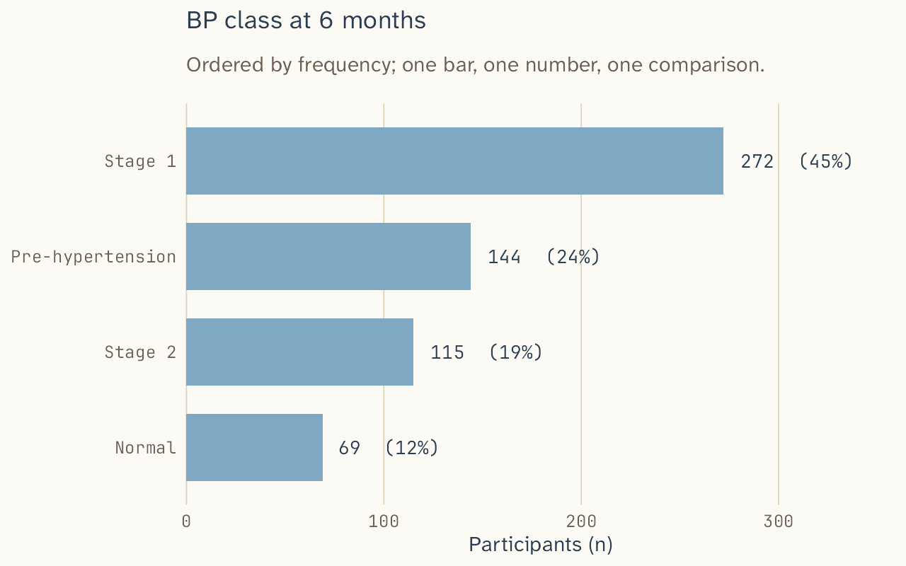{#fig-bar}

> [!note]
## Code

#### R

```r
library(ggplot2); library(pequod); library(dplyr)

bp_counts <- cohort |>
  count(bp_class_6m) |>
  mutate(pct = n / sum(n))

ggplot(bp_counts, aes(reorder(bp_class_6m, n), n)) +
  geom_col(fill = pequod_crew_dark[["Starbuck"]], width = 0.7) +
  geom_text(aes(label = sprintf("%d  (%.0f%%)", n, 100 * pct)),
            hjust = -0.15, family = "JetBrains Mono", size = 3.4) +
  coord_flip(clip = "off") +
  scale_y_continuous(expand = expansion(mult = c(0, 0.32))) +
  labs(x = NULL, y = "Participants (n)") +
  theme_minimal(base_family = "Atkinson Hyperlegible Next")
```

#### Python

```python
import pandas as pd
import seaborn as sns
import matplotlib.pyplot as plt
import pequod

cohort = pd.read_csv("figures/cohort.csv")
counts = (cohort["bp_class_6m"].value_counts()
          .rename_axis("class").reset_index(name="n"))
counts = counts.sort_values("n")
counts["pct"] = counts["n"] / counts["n"].sum()

fig, ax = plt.subplots(figsize=(6.4, 4))
sns.barplot(data=counts, y="class", x="n",
            color=pequod.CREW_DARK["Starbuck"], ax=ax)
for i, row in counts.iterrows():
    ax.text(row["n"] + 6, i, f'{row["n"]}  ({row["pct"]:.0%})',
            va="center", family="JetBrains Mono")
ax.set(xlabel="Participants (n)", ylabel=None)
sns.despine(); fig.tight_layout()
```

### 2. Rainbow heatmap → sequential ramp

The default `rainbow()` palette stays popular in scientific computing despite being non-monotonic in luminance: yellow is brighter than red and green, and the eye reads brightness as magnitude. A sequential ramp (light to dark) maps luminance and value onto the same axis, so bigger means darker without ambiguity. The Pequod `log-cool` palette is one such ramp; viridis is another. Compare the same heatmap rendered both ways, @fig-rainbow against @fig-sequential.

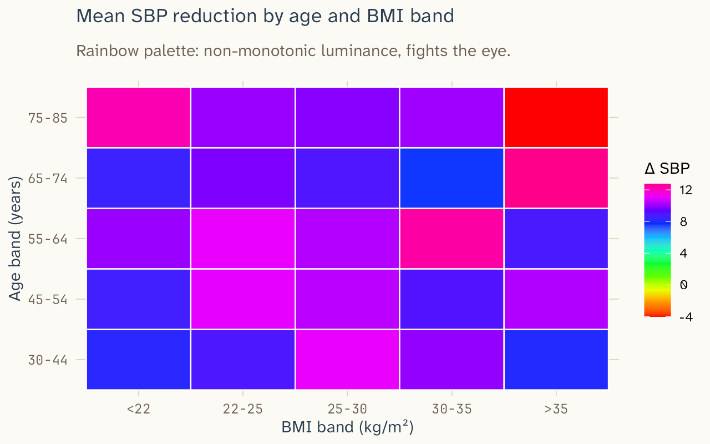{#fig-rainbow}

{#fig-sequential}

> [!note]
## Code

#### R

```r
library(ggplot2); library(pequod); library(dplyr)

heat <- cohort |>
  mutate(
    age_band = cut(age, c(29, 45, 55, 65, 75, 86), include.lowest = TRUE,
                   labels = c("30-44","45-54","55-64","65-74","75-85")),
    bmi_band = cut(bmi, c(0, 22, 25, 30, 35, 100), include.lowest = TRUE,
                   labels = c("<22","22-25","25-30","30-35",">35"))
  ) |>
  group_by(age_band, bmi_band) |>
  summarise(delta = mean(sbp_baseline - sbp_6m), .groups = "drop")

ggplot(heat, aes(bmi_band, age_band, fill = delta)) +
  geom_tile(colour = "white", linewidth = 0.4) +
  scale_fill_pequod_c(palette = "log-cool", name = "Δ SBP\n(mmHg)") +
  geom_text(aes(label = sprintf("%.1f", delta)),
            family = "JetBrains Mono", size = 3.1, colour = "white") +
  labs(x = "BMI band (kg/m²)", y = "Age band (years)") +
  theme_minimal(base_family = "Atkinson Hyperlegible Next")
```

#### Python

```python
import seaborn as sns
import matplotlib.pyplot as plt
import pequod
import numpy as np

pequod.register_cmaps()

heat = (cohort.assign(
    age_band = pd.cut(cohort["age"], [29,45,55,65,75,86],
                      labels=["30-44","45-54","55-64","65-74","75-85"]),
    bmi_band = pd.cut(cohort["bmi"], [0,22,25,30,35,100],
                      labels=["<22","22-25","25-30","30-35",">35"]),
    delta    = cohort["sbp_baseline"] - cohort["sbp_6m"])
    .groupby(["age_band","bmi_band"])["delta"].mean().unstack())

fig, ax = plt.subplots(figsize=(6.4, 4))
sns.heatmap(heat, cmap="pequod_log_cool", annot=True, fmt=".1f",
            annot_kws={"family": "JetBrains Mono"},
            cbar_kws={"label": "Δ SBP (mmHg)"}, ax=ax)
ax.set(xlabel="BMI band (kg/m²)", ylabel="Age band (years)")
fig.tight_layout()
```

### 3. Truncated y-axis → honest baseline

This is the single most common dishonest figure in clinical journals. Pick a y-axis that starts somewhere convenient (132 mmHg in the example below) and a 10-mmHg gap looks like a chasm. The numbers are right; the visual claim is wrong. Tufte calls this a *lie factor* [@tufte2001visual], Wilke calls it *proportional ink* [@wilke2019fundamentals]. The fix is to anchor at zero whenever the y-axis encodes magnitude with bar length. If the differences then look small, the differences *are* small, and the chart should say so. @fig-truncated and @fig-honest plot the same four numbers.

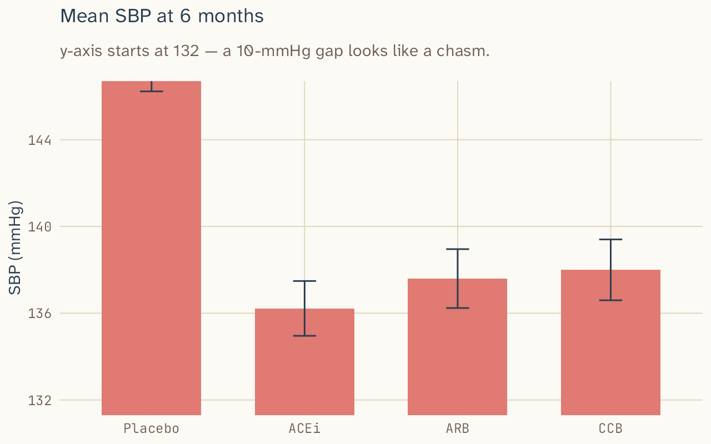{#fig-truncated}

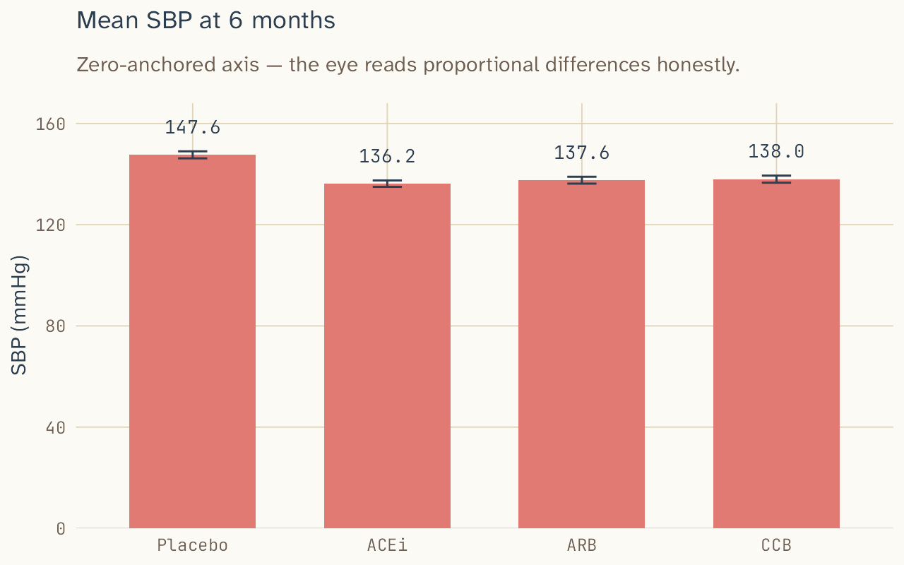{#fig-honest}

> [!warning]
## When truncation is honest

The zero rule applies to *bar lengths* because the bar's length encodes the value. It does not apply to *line charts* or *dot plots* showing position over time, where the eye reads the slope of change rather than the height of an ink rectangle. A heart-rate strip from 60 to 100 bpm need not show the gap from 0 to 60: there is no rectangle to inflate.

> [!note]
## Code

#### R

```r
library(ggplot2); library(pequod); library(dplyr)

trt_summary <- cohort |>
  group_by(treatment) |>
  summarise(sbp_6m_mean = mean(sbp_6m),
            se = sd(sbp_6m) / sqrt(n()), .groups = "drop")

ggplot(trt_summary, aes(treatment, sbp_6m_mean)) +
  geom_col(fill = pequod_crew_dark[["Ahab"]], width = 0.65) +
  geom_errorbar(aes(ymin = sbp_6m_mean - se, ymax = sbp_6m_mean + se),
                width = 0.15) +
  geom_text(aes(label = sprintf("%.1f", sbp_6m_mean)),
            vjust = -1.6, family = "JetBrains Mono", size = 3.4) +
  scale_y_continuous(limits = c(0, 160),
                     expand = expansion(mult = c(0, 0.05))) +
  labs(x = NULL, y = "SBP (mmHg)") +
  theme_minimal(base_family = "Atkinson Hyperlegible Next")
```

#### Python

```python
import seaborn as sns
import matplotlib.pyplot as plt
import pequod

summ = (cohort.groupby("treatment")["sbp_6m"]
              .agg(mean="mean", se=lambda x: x.std()/len(x)**0.5)
              .reset_index())

fig, ax = plt.subplots(figsize=(6.4, 4))
sns.barplot(data=summ, x="treatment", y="mean",
            color=pequod.CREW_DARK["Ahab"], errorbar=None, ax=ax)
ax.errorbar(x=summ["treatment"], y=summ["mean"], yerr=summ["se"],
            fmt="none", color="black", capsize=4)
for i, m in enumerate(summ["mean"]):
    ax.text(i, m + 4, f"{m:.1f}", ha="center", family="JetBrains Mono")
ax.set(xlabel=None, ylabel="SBP (mmHg)", ylim=(0, 160))
sns.despine(); fig.tight_layout()
```

### 4. Donut row → ranked dot plot

A row of pies or donuts asks the reader to compare angles across panels. Each donut is its own coordinate system, and the eye cannot triangulate between them. A dot plot puts every group on a single common scale, sortable by effect, and the comparison becomes automatic. The same data appears in @fig-donut and @fig-dotplot.

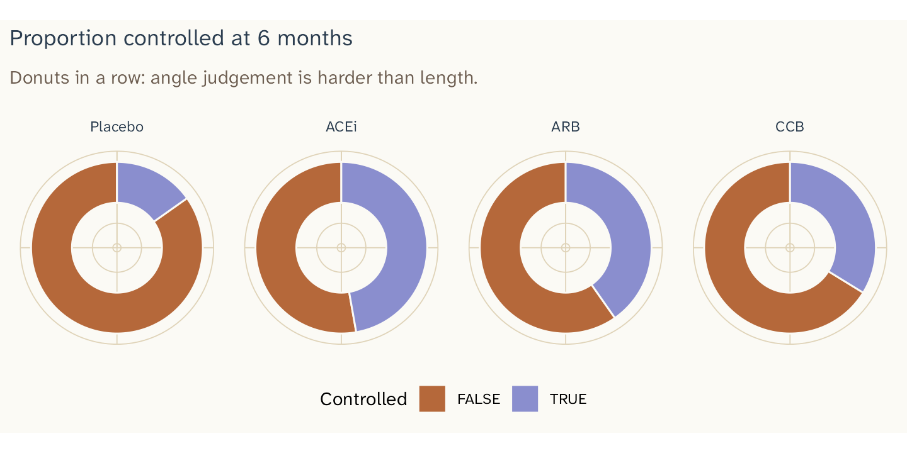{#fig-donut}

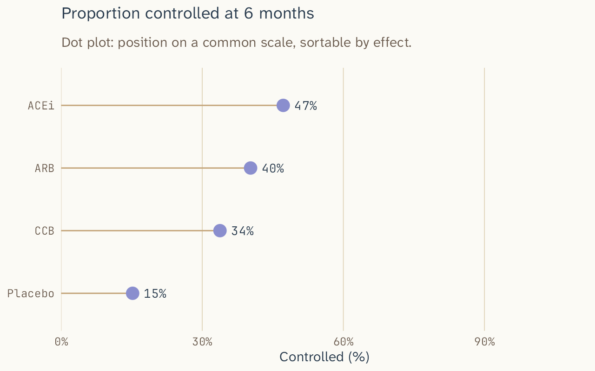{#fig-dotplot}

> [!note]
## Code

#### R

```r
library(ggplot2); library(pequod); library(dplyr); library(scales)

ctrl <- cohort |>
  count(treatment, controlled_6m) |>
  group_by(treatment) |>
  mutate(pct = n / sum(n)) |>
  ungroup() |>
  filter(controlled_6m)

ggplot(ctrl, aes(reorder(treatment, pct), pct)) +
  geom_segment(aes(xend = treatment, y = 0, yend = pct),
               colour = pequod_log[["Log 300"]]) +
  geom_point(colour = pequod_crew_dark[["Queequeg"]], size = 4.2) +
  geom_text(aes(label = scales::percent(pct, accuracy = 1)),
            hjust = -0.5, family = "JetBrains Mono", size = 3.4) +
  coord_flip() +
  scale_y_continuous(labels = scales::percent_format(),
                     limits = c(0, 1)) +
  labs(x = NULL, y = "Controlled (%)") +
  theme_minimal(base_family = "Atkinson Hyperlegible Next")
```

#### Python

```python
import seaborn as sns
import matplotlib.pyplot as plt
import pequod

ctrl = (cohort.groupby("treatment")["controlled_6m"]
              .mean().reset_index(name="pct")
              .sort_values("pct"))

fig, ax = plt.subplots(figsize=(6.4, 4))
ax.hlines(y=ctrl["treatment"], xmin=0, xmax=ctrl["pct"],
          colors=pequod.LOG["Log 300"])
ax.scatter(ctrl["pct"], ctrl["treatment"],
           color=pequod.CREW_DARK["Queequeg"], s=140, zorder=3)
for _, r in ctrl.iterrows():
    ax.text(r["pct"] + 0.02, r["treatment"], f'{r["pct"]:.0%}',
            va="center", family="JetBrains Mono")
ax.set(xlabel="Controlled (%)", ylabel=None, xlim=(0, 1))
sns.despine(); fig.tight_layout()
```

### 5. Dual-axis line chart → small multiples

A second y-axis is the rare chart sin that works against the reader without lying. It invents a relationship by drawing two lines on top of each other; whether the eye reads BMI as "above" or "below" SBP depends entirely on the secondary scale you happened to pick. Two trends that are statistically uncorrelated can be made to look identical, and two that are perfectly correlated can be made to look opposed. Small multiples solve this without effort: each variable gets its own panel and its own axis, and the comparison stays a comparison rather than a coincidence. See @fig-dualaxis and @fig-smallmult.

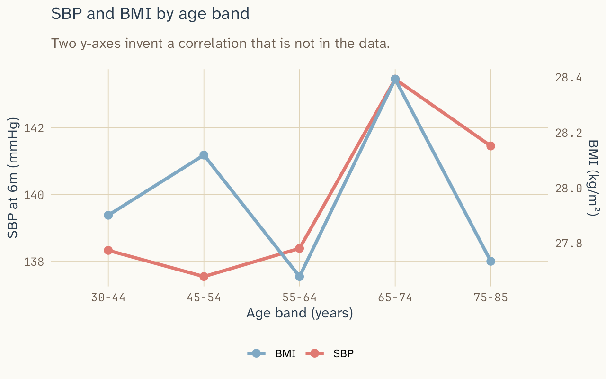{#fig-dualaxis}

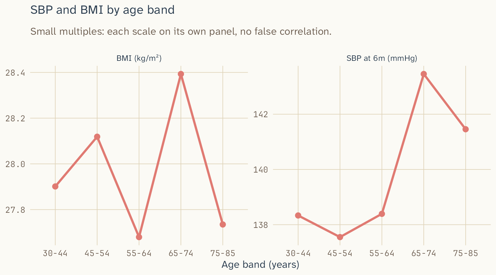{#fig-smallmult}

> [!note]
## Code

#### R

```r
library(ggplot2); library(pequod); library(dplyr); library(tidyr)

da <- cohort |>
  mutate(age_band = cut(age, c(30,45,55,65,75,85), include.lowest = TRUE,
                        labels = c("30-44","45-54","55-64","65-74","75-85"))) |>
  group_by(age_band) |>
  summarise(SBP = mean(sbp_6m), BMI = mean(bmi), .groups = "drop") |>
  pivot_longer(c(SBP, BMI), names_to = "metric", values_to = "value")

ggplot(da, aes(age_band, value, group = 1)) +
  geom_line(colour = pequod_crew_dark[["Ahab"]], linewidth = 1.1) +
  geom_point(colour = pequod_crew_dark[["Ahab"]], size = 2.4) +
  facet_wrap(~ metric, scales = "free_y") +
  labs(x = "Age band", y = NULL) +
  theme_minimal(base_family = "Atkinson Hyperlegible Next")
```

#### Python

```python
import seaborn as sns
import matplotlib.pyplot as plt
import pequod

da = (cohort.assign(
    age_band = pd.cut(cohort["age"], [30,45,55,65,75,85],
                      labels=["30-44","45-54","55-64","65-74","75-85"]))
    .groupby("age_band")[["sbp_6m","bmi"]].mean()
    .reset_index().rename(columns={"sbp_6m":"SBP","bmi":"BMI"})
    .melt(id_vars="age_band", var_name="metric"))

g = sns.relplot(data=da, x="age_band", y="value", col="metric",
                kind="line", marker="o", facet_kws={"sharey": False},
                color=pequod.CREW_DARK["Ahab"], height=3.2, aspect=1.0)
g.set_axis_labels("Age band", "")
```

### 6. Mean ± SE bar → distribution

Bar charts of means with error whiskers are the most-criticised chart pattern in modern statistics. They imply a symmetric sampling distribution that often does not exist, hide the sample size, and hide the outliers. Weissgerber and colleagues showed that distinct distributions can produce visually identical bar-and-whisker plots [@weissgerber2015beyond]. The fix is to show the data: a box plot, a strip plot, a violin, or any combination thereof. A mean is a single number; the distribution is what determines whether that number is informative. @fig-meanbar collapses the four arms into a single statistic; @fig-distribution shows what is actually there.

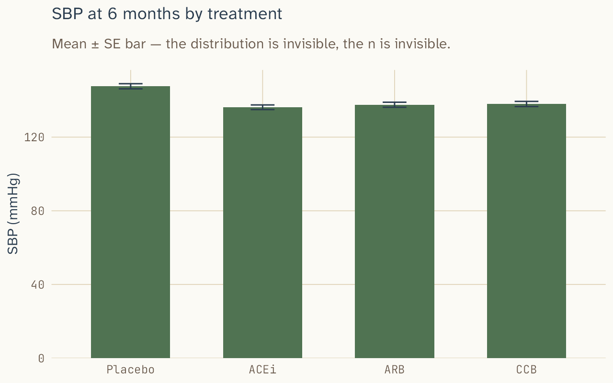{#fig-meanbar}

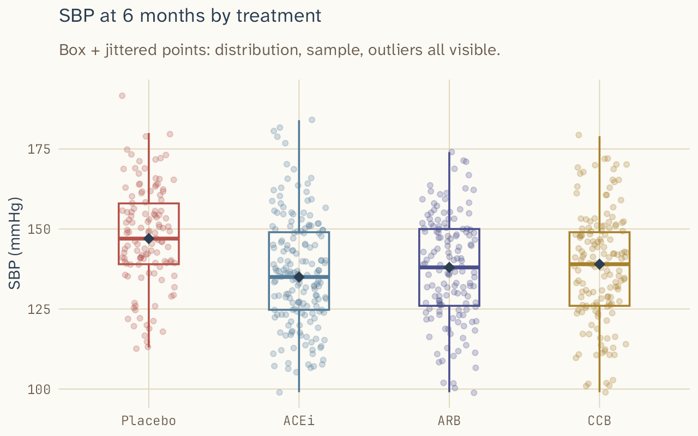{#fig-distribution}

> [!note]
## Code

#### R

```r
library(ggplot2); library(pequod)

ggplot(cohort, aes(treatment, sbp_6m, colour = treatment)) +
  geom_jitter(width = 0.18, alpha = 0.25, size = 1.4) +
  geom_boxplot(width = 0.4, fill = NA, outlier.shape = NA, linewidth = 0.6) +
  stat_summary(fun = median, geom = "point", shape = 18, size = 3.2,
               colour = "black") +
  scale_colour_pequod_d(palette = "crew") +
  labs(x = NULL, y = "SBP (mmHg)") +
  theme_minimal(base_family = "Atkinson Hyperlegible Next") +
  theme(legend.position = "none")
```

#### Python

```python
import seaborn as sns
import matplotlib.pyplot as plt
import pequod

crew = list(pequod.CREW_DARK.values())[:4]

fig, ax = plt.subplots(figsize=(6.4, 4))
sns.stripplot(data=cohort, x="treatment", y="sbp_6m",
              palette=crew, alpha=0.25, jitter=0.18, ax=ax)
sns.boxplot(data=cohort, x="treatment", y="sbp_6m",
            palette=crew, showfliers=False, fill=False,
            width=0.4, ax=ax)
ax.set(xlabel=None, ylabel="SBP (mmHg)")
sns.despine(); fig.tight_layout()
```

### 7. Spaghetti longitudinal → small multiples with mean

A spaghetti plot of every patient's trajectory has its uses: it is the right chart when the message is heterogeneity. For showing a treatment effect, it makes the reader work harder than necessary. Faceting the spaghetti by treatment and overlaying the group mean keeps the heterogeneity visible while letting the average do the rhetorical work, as in the move from @fig-spaghetti to @fig-faceted.

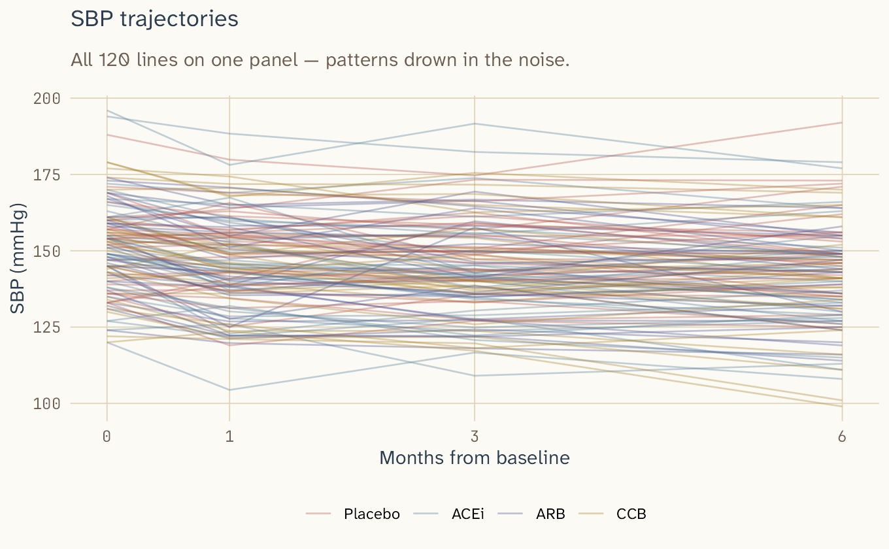{#fig-spaghetti}

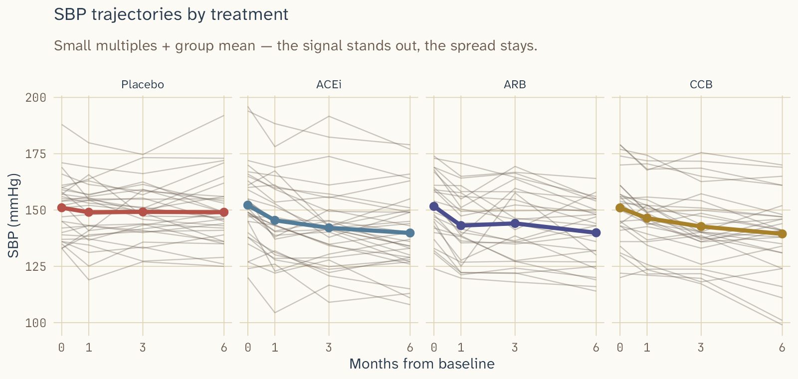{#fig-faceted}

> [!note]
## Code

#### R

```r
library(ggplot2); library(pequod); library(dplyr); library(tidyr)

# `traj` is the long-format cohort with months 0/1/3/6 and SBP per id.
traj_summary <- traj |>
  group_by(treatment, month) |>
  summarise(sbp = mean(sbp), .groups = "drop")

ggplot(mapping = aes(month, sbp)) +
  geom_line(data = traj, aes(group = id),
            colour = "grey70", alpha = 0.35, linewidth = 0.4) +
  geom_line(data = traj_summary,
            aes(group = treatment, colour = treatment), linewidth = 1.4) +
  geom_point(data = traj_summary, aes(colour = treatment), size = 2.4) +
  scale_colour_pequod_d(palette = "crew") +
  facet_wrap(~ treatment, nrow = 1) +
  labs(x = "Months from baseline", y = "SBP (mmHg)") +
  theme_minimal(base_family = "Atkinson Hyperlegible Next") +
  theme(legend.position = "none")
```

#### Python

```python
import seaborn as sns
import matplotlib.pyplot as plt
import pequod

crew = list(pequod.CREW_DARK.values())[:4]

g = sns.FacetGrid(traj, col="treatment", hue="treatment",
                  palette=crew, height=3.2, aspect=1.0,
                  sharey=True)
g.map_dataframe(sns.lineplot, x="month", y="sbp",
                units="id", estimator=None,
                color="lightgrey", alpha=0.35, linewidth=0.5)
g.map_dataframe(sns.lineplot, x="month", y="sbp",
                estimator="mean", linewidth=2.0, marker="o")
g.set_axis_labels("Months from baseline", "SBP (mmHg)")
```

## Captions that read themselves

Wilke's chapter on captions states the rule plainly: a reader who sees only the figure and the caption, without the methods or the results, should know what was studied, what was measured, and what was found [@wilke2019fundamentals]. A complete caption includes a short title (what is being shown), the groups or conditions (what each colour, line, or symbol represents), the statistical test and which groups are being compared, the sample size for each group, and definitions of any abbreviations.

A short example. The caption

> *"SBP at 6 months by treatment."*

becomes

> *"Systolic blood pressure (SBP) at six months by randomised treatment arm (Placebo, ACEi, ARB, CCB; n = 122/183/142/153). Boxes show median and IQR; whiskers extend to the most extreme value within 1.5 × IQR. Individual participants shown as jittered points. Simulated cohort, n = 600."*

The first answers nothing without the methods open. The second answers everything from the figure outward.

The caption is the part of the figure that does not need to be drawn. Treat it as part of the figure rather than part of the text. Reviewers will read it before the results paragraph.

## Telling a story with one figure

A results figure is an argument. Decide the one sentence the figure has to make ("ACEi and ARB lower SBP by about 12 mmHg over six months; placebo regresses to the mean by 3") and let every visual choice serve that sentence [@cairo2016truthful; @wilke2019fundamentals].

The reader's eye lands somewhere first, and the chart should make sure it lands where you want it. Choose the most striking ink in the chart, a bolder line, a darker fill, a labelled point, to be the *finding*. Push everything else into the background with thinner lines, lighter colours, smaller type. The hero of the figure should be unambiguous within the first second of looking at it.

The hero figure of this note (top of the page) does this with the four crew accents. None of the four arms is the answer in isolation, so none has visual emphasis over the others. If the answer were that ARB outperforms the rest, the chart would reflect that: ARB at full opacity, the others at 0.4. The visual emphasis encodes the argument.

## The Pequod palette in figure roles

The palette has three functional groups, and the chart you draw should use them according to function rather than aesthetics.

The Log scale (twelve steps from warm paper to deep ink) is the right palette for sequential or continuous data: heatmaps, density colour ramps, depth-encoded scatter. In R, `scale_fill_pequod_c(palette = "log-cool")`; in matplotlib or seaborn, `cmap="pequod_log_cool"` after `pequod.register_cmaps()`.

The eight crew accents (Ahab, Starbuck, Queequeg, Pip, Ishmael, Stubb, Tashtego, Daggoo) are for categorical data with up to eight groups. Beyond eight, collapse the rare categories into "Other" and re-encode by shape or position. Use `scale_colour_pequod_d(palette = "crew")` in R, or `palette=list(pequod.CREW_DARK.values())` for an explicit list in seaborn.

The light and dark variants of the crew are for light and dark backgrounds, not for two different categorical mappings. Use `pequod_crew_light` on Log 50 paper, `pequod_crew_dark` on Log 950 ink.

The palette has documented colour-vision-deficiency collapses (Pip ↔ Stubb under tritanopia, Ahab ↔ Daggoo under protanopia). When the colour distinction carries the result, as in diff gutters, error states, or "treated vs control" in a two-arm trial, pair the colour with a shape or weight. Hue alone is not enough.

## Using AI tools for figures

Generative tools are now routinely used to draft figures, write the code that produces them, and refine the layout. The principle from the [scientific writing note](/notes/sw/#using-ai-tools-responsibly) carries over.

Code suggestions for plot construction (drafting a `ggplot` call from a verbal description) are equivalent to language editing. Disclose when the journal asks; review every line before you commit it. Figure generation by an image model ("render a forest plot of these effect sizes") must be disclosed and is increasingly scrutinised. The figure must come from your data, not from a model's reconstruction of what such a figure usually looks like. Fabricating data, units, or annotations is misconduct, and the figure is the easiest place for fabrication to slip in. Every label, every n, every confidence interval comes from the analysis.

A model disclosure sentence that fits most figure work:

> *"During the preparation of this work, the authors used [tool/model] for code suggestions in figure construction. After using this tool, the authors reviewed and edited the output and take full responsibility for the figures presented."*

## Plain-language summary

Good charts make readers' lives easier; bad charts make them harder. The fix is rarely a fancier tool. It is choosing the right encoding for the data (position over angle, length over area, luminance over hue), anchoring the y-axis at zero when bars are involved, showing the spread of the data instead of just the mean, splitting busy panels into small multiples, and writing a caption that the figure can stand on. None of this is exotic, and all of it is learnable.

## References

::: {#refs}

