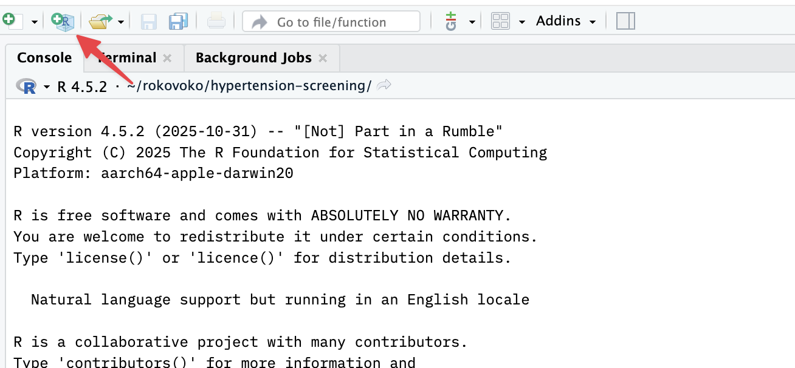
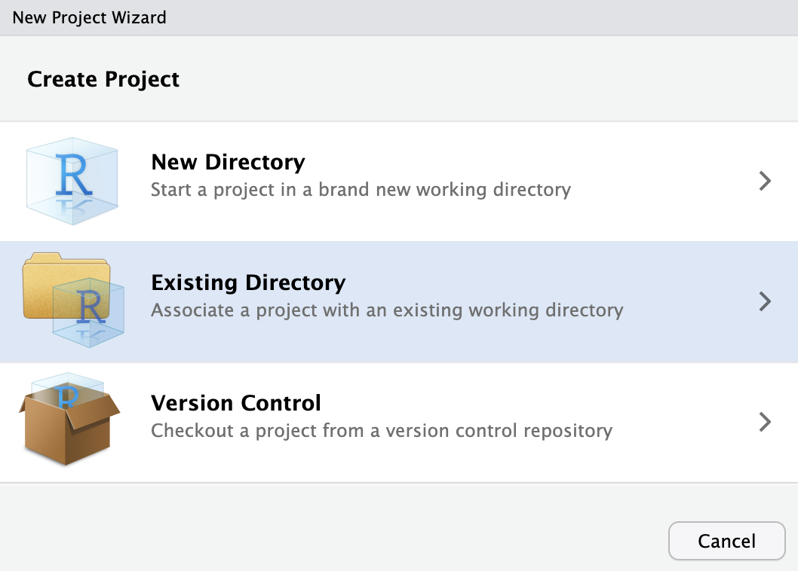
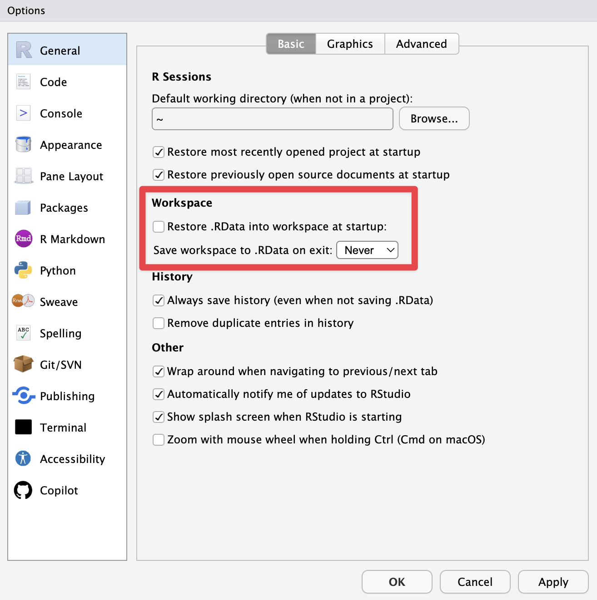
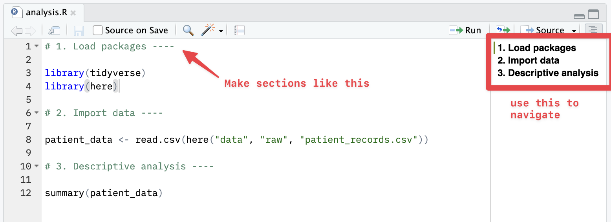
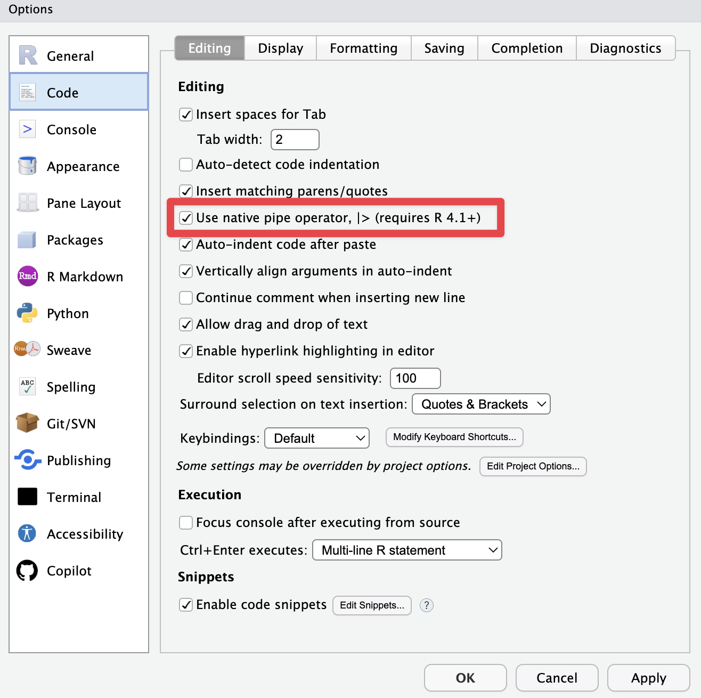
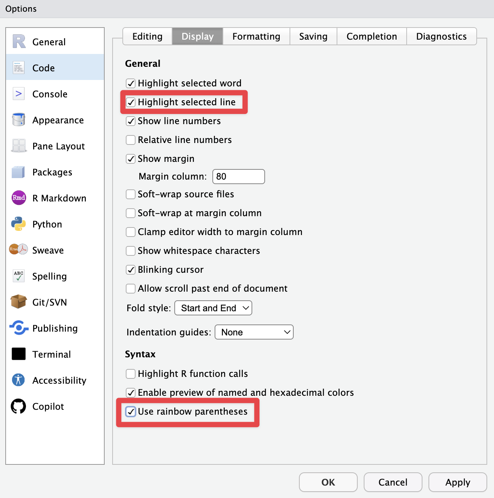

## Why talk about best practices?

Knowing how to write R code is one thing. Working in a way that is organised, reproducible, and free of headaches weeks or months later is something else entirely.

If you have ever opened an old script and had no idea what you did, or wasted time tracking down a data file, or had to re-run an entire analysis just to figure out what a variable contains, this guide is for you.

Whether you are a medical student analysing clinical data for a research project or a digital health student building a data pipeline, these habits will make your work easier to understand, easier to share, and easier to trust.

You do not need to start from scratch. Make small adjustments and see the difference; your future self will thank you.

## 1. Always use RStudio Projects

The first and most important practice: **never work outside an RStudio Project** (`.Rproj`).

An RStudio Project is simply a folder with an `.Rproj` file that RStudio recognises as a working environment. In practical terms, this means:

- The **working directory** (the default location where R looks for and saves files) is automatically set to the project folder. No need to ever use `setwd()`.
- Open files, history, and environment variables are all tied to the project.
- You can have several projects open in separate sessions without them interfering with each other.

### How to create a project

`File -> New Project -> New Directory -> New Project`



Give it a clear name and choose a sensible location. Every important analysis deserves its own project: a clinical study, a coursework assignment, a data cleaning task.



### Suggested folder structure

```
hypertension-screening/
├── hypertension-screening.Rproj
├── .gitignore
├── data/
│   ├── raw/          # original data — never edit these files
│   └── processed/    # data cleaned or transformed by your scripts
├── scripts/          # .R or .qmd files
├── outputs/
│   ├── figures/
│   └── tables/
└── README.md
```

## 2. Keep your environment clean: do not save `.RData`

By default, RStudio asks whether you want to save the workspace (`.RData`) when you close a session. The answer should **always be no**.

Why? Because a saved workspace accumulates objects from previous sessions that you can no longer trace back to their origin. Your code should be the single source of truth: if you run the script from top to bottom, you should get the same results every time.

This matters especially in health research. If your analysis of patient outcomes depends on a variable that was created interactively and never saved in the script, your results are not reproducible, and irreproducible results have no place in clinical research.

To disable this permanently:

`Tools -> Global Options -> General -> Workspace`

- "Restore .RData into workspace at startup": **uncheck**
- "Save workspace to .RData on exit": **Never**



## 3. Write code that reads well

### Use descriptive names

```r
# Poor
x <- read.csv("data.csv")
y <- mean(x$v1, na.rm = TRUE)

# Better
patient_data <- read.csv("data/raw/patient_records.csv")
mean_age <- mean(patient_data$age, na.rm = TRUE)
```

Names like `x` and `y` tell you nothing when you revisit the script two months later. ^[And in my case, it's enough to revisit tomorrow.] Names like `patient_data` and `mean_age` make the code self-explanatory.

### Structure your script with sections

RStudio recognises sections when you end a comment with `# ----` or `# ====`:

```r
# 1. Load packages ----

library(tidyverse)
library(here)

# 2. Import data ----

patient_data <- read.csv(here("data", "raw", "patient_records.csv"))

# 3. Descriptive analysis ----

summary(patient_data)
```

```
   patient_id         age          systolic_bp     sex           
 PT0001 :  1   Min.   :18.0   Min.   : 92.0   F   :3241  
 PT0002 :  1   1st Qu.:52.0   1st Qu.:118.0   M   :3600  
 PT0003 :  1   Median :64.0   Median :131.0                
 (Other):6838   Mean   :63.4   Mean   :133.7                
                3rd Qu.:76.0   3rd Qu.:147.0                
                Max.   :98.0   Max.   :212.0                
                NA's   :12                                  
```



This creates a navigable outline, which is very helpful in longer scripts.

### One operation per line

Avoid chaining too many operations on a single line. With the pipe operator (`|>` or `%>%`), you can chain steps in a readable way:

```r
# Hard to read
result <- filter(mutate(select(patient_data, patient_id, age, systolic_bp), bp_category = ifelse(systolic_bp >= 140, "hypertensive", "normotensive")), !is.na(systolic_bp))

# Easy to read
result <- patient_data |>
  select(patient_id, age, systolic_bp) |>
  mutate(bp_category = ifelse(systolic_bp >= 140, "hypertensive", "normotensive")) |>
  filter(!is.na(systolic_bp))
```

Both produce the same result: a filtered, mutated data frame. The second version tells you what it does as you read it top to bottom.

### Comment the *why*, not the *what*

The code already says *what* it does. Your comment should explain *why*.

```r
# Poor comment
mean_age <- mean(patient_data$age)  # calculate the mean age
```

```
[1] NA
```

The result is `NA` because `age` contains missing values and `mean()` defaults to `na.rm = FALSE`. A reader of the "poor" comment has no idea why. A reader of the "better" one does:

```r
# Better comment
# Exclude NA before computing the mean — 12 patients had no recorded age at enrolment
mean_age <- mean(patient_data$age, na.rm = TRUE)
```

```
[1] 63.4
```

---

## 4. Use the `here` package for file paths

Never write absolute file paths in your code. They are fragile and will not work on anyone else's computer, or even on your own if you move the folder.

```r
# Poor — will not work on another computer
patient_data <- read.csv("/Users/tiago/Documents/project/data/raw/patient_records.csv")
```

```
Error in file(file, "rt") : cannot open the connection
In addition: Warning message:
In file(file, "rt") :
  cannot open file '/Users/tiago/Documents/project/data/raw/patient_records.csv': No such file or directory
```

```r
# Better — works on any computer with the project
library(here)
patient_data <- read.csv(here("data", "raw", "patient_records.csv"))
```

```
# (no output — file loaded silently into patient_data)
```

The `here()` function builds the file path relative to the root of the RStudio Project. Simple, portable, and reproducible!

---

## 5. Essential keyboard shortcuts

These shortcuts save a considerable amount of time. They are worth memorising.

| Action | Windows/Linux | macOS |
|---|---|---|
| Run line or selection | `Ctrl + Enter` | `Cmd + Enter` |
| Run entire script | `Ctrl + Shift + Enter` | `Cmd + Shift + Enter` |
| Insert pipe operator `|>` | `Ctrl + Shift + M` | `Cmd + Shift + M` |
| Insert assignment operator `<-` | `Alt + -` | `Option + -` |
| Comment/uncomment lines | `Ctrl + Shift + C` | `Cmd + Shift + C` |
| Go to line | `Ctrl + G` | `Cmd + G` |
| Find in file | `Ctrl + F` | `Cmd + F` |
| Find in files | `Ctrl + Shift + F` | `Cmd + Shift + F` |
| Show all shortcuts | `Alt + Shift + K` | `Option + Shift + K` |
| Clear console | `Ctrl + L` | `Ctrl + L` |
| Restart R session | `Ctrl + Shift + F10` | `Cmd + Shift + F10` |
| New script | `Ctrl + Shift + N` | `Cmd + Shift + N` |

: Essential RStudio shortcuts {.striped .hover}

**Tip:** restart your R session (`Ctrl/Cmd + Shift + F10`) frequently while developing. If your code no longer works after a restart, you have hidden dependencies in your environment, most likely objects created interactively that were never saved in the script.

Go to `Help -> Keyboard Shortcuts Help` for a full list.

---

## 6. Code Style

### Configure the native R pipe

Since R 4.1, there is a built-in pipe operator: `|>`. It is equivalent to the `%>%` from `magrittr`/`tidyverse` for most use cases, and it does not require loading any package.

To make the shortcut `Ctrl/Cmd + Shift + M` insert the native pipe:

`Tools -> Global Options -> Code -> Use native pipe operator, |>`



### Visual tweaks

I like to turn on the line highlighting and the rainbow brackets in RStudio; it's a helpful visual guide, particularly if you have long lines of code.

`Tools -> Global Options -> Code -> Display`



## 7. Install packages once, load them every time

Never place `install.packages()` at the top of an analysis script. Installation is a one-time operation; loading (`library()`) is what belongs in the script.

```r
# Do not do this in an analysis script:
install.packages("tidyverse")  # No!
```

```
Installing package into '/Users/tiago/R/library'
(as 'lib' is unspecified)
trying URL 'https://cran.rstudio.com/bin/macosx/big-sur-arm64/contrib/4.4/tidyverse_2.0.0.tgz'
Content type 'application/x-gzip' length 433228 bytes (423 KB)
...
```

Running `install.packages()` inside a shared or automated script will silently try to install packages on every run, or fail loudly on a system where installation requires admin rights.

```r
# Do this instead — just load the package:
library(tidyverse)
```

```
── Attaching core tidyverse packages ──────── tidyverse 2.0.0 ──
✔ dplyr     1.1.4     ✔ readr     2.1.5
✔ forcats   1.0.0     ✔ stringr   1.5.1
✔ ggplot2   3.5.1     ✔ tibble    3.2.1
✔ lubridate 1.9.3     ✔ tidyr     1.3.1
✔ purrr     1.0.2     
── Conflicts ──────────────────────── tidyverse_conflicts() ──
✖ dplyr::filter() masks stats::filter()
✖ dplyr::lag()    masks stats::lag()
```

If you want to check whether a package is installed and install it only when necessary, there is a clean way to do it:

```r
if (!require("tidyverse", quietly = TRUE)) install.packages("tidyverse")
library(tidyverse)
```

```
── Attaching core tidyverse packages ──────── tidyverse 2.0.0 ──
✔ dplyr     1.1.4     ✔ readr     2.1.5
...
```

### Pin package versions with `renv`

For anything that will be re-run in six months or shared with a co-author, use [`renv`](https://rstudio.github.io/renv/). It creates a per-project library, records the exact version of every package you use in a lockfile, and lets collaborators (or your future self) install the same versions with a single command. Initialise it inside the project:

```r
install.packages("renv")
renv::init()        # create a project-local library and an renv.lock file
# ... write your analysis, install packages normally ...
renv::snapshot()    # record the current versions
```

Commit `renv.lock` together with your scripts. On another machine, `renv::restore()` reads the lockfile and installs the same versions. This turns "it worked on my laptop" into "it works on any laptop", which is essential for reproducible health-research analyses.

---

## 8. Use Quarto (or R Markdown) for documented analyses

For analyses that need to be shared or documented (a coursework report, a clinical data summary, a research methods section), a `.qmd` ([Quarto](https://quarto.org/)) or `.Rmd` ([R Markdown](https://rmarkdown.rstudio.com/)) file is far more suitable than a plain `.R` script.

In a Quarto document:

- Explanatory text and code live in the same file.
- Outputs (tables, figures) are generated automatically when the document is rendered.
- You can produce HTML, PDF, or Word with a single click.

This is particularly useful in health sciences, where you often need to present both the analysis and its interpretation together; for example, a report describing patient demographics, laboratory results, and statistical comparisons all in one document.

This post itself was written in Quarto.

## Summary

Here's the summary of this list of best practices for RStudio. It's by no means complete, but it covers the most important ones.

| Practice | Why it matters |
|---|---|
| Use RStudio Projects | Eliminates working directory problems |
| Do not save `.RData` | Ensures reproducibility |
| Descriptive names and useful comments | Code remains readable months later |
| Script sections | Fast navigation in long scripts |
| The `here` package | Portable file paths across computers |
| Restart the session frequently | Catches hidden dependencies |
| Keyboard shortcuts | Speed and focus on what matters |

If you adopt only one practice from this list, make it **RStudio Projects**. The rest will follow naturally with time.

## Related notes

- [Git for health researchers](/notes/git/): put every RStudio Project under version control from day one, so every change is traceable and recoverable.
- [GitHub for health researchers](/notes/github/): share your project, collaborate, and use GitHub Actions to run an analysis pipeline on push.
- [OpenCode: an AI research assistant in your terminal](/notes/opencode/): for R debugging and pipeline generation with an agent that can read your scripts and data directly.

If you have any comments or questions, feel free to [reach out](mailto:tiagojacinto@med.up.pt).
