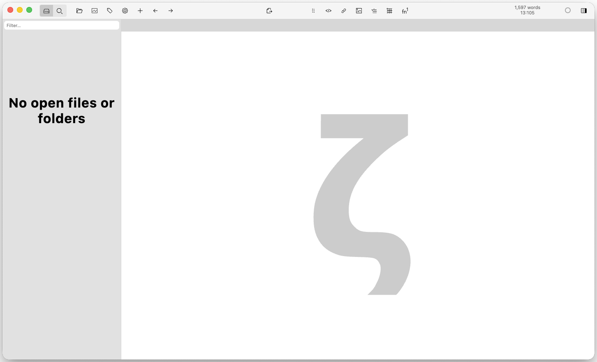
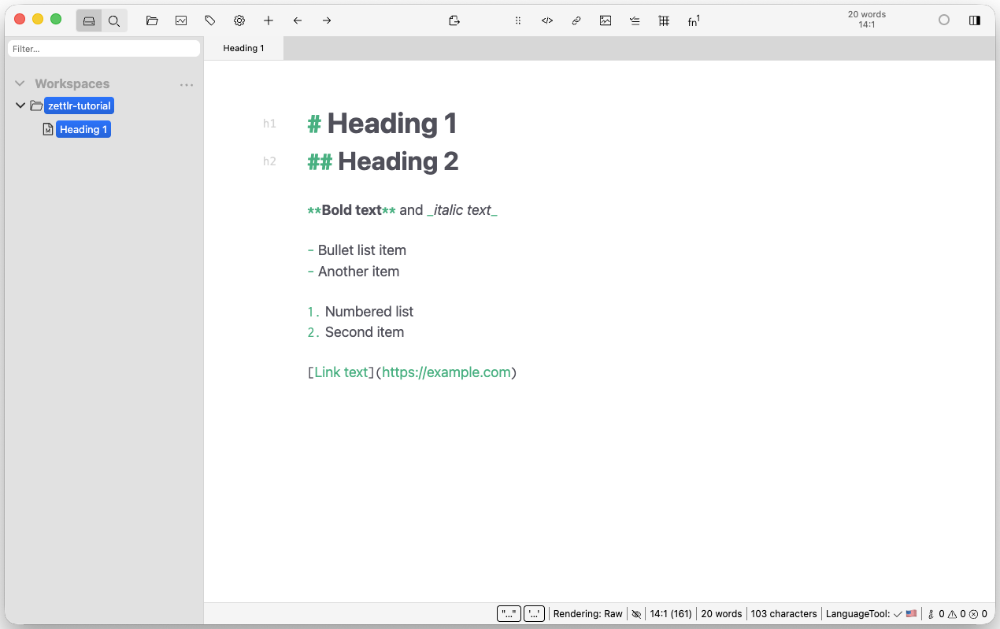
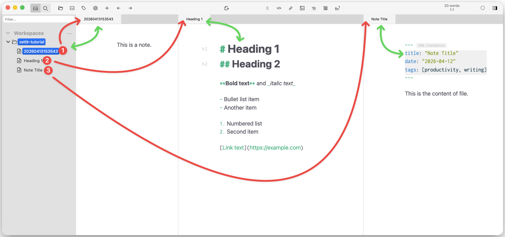
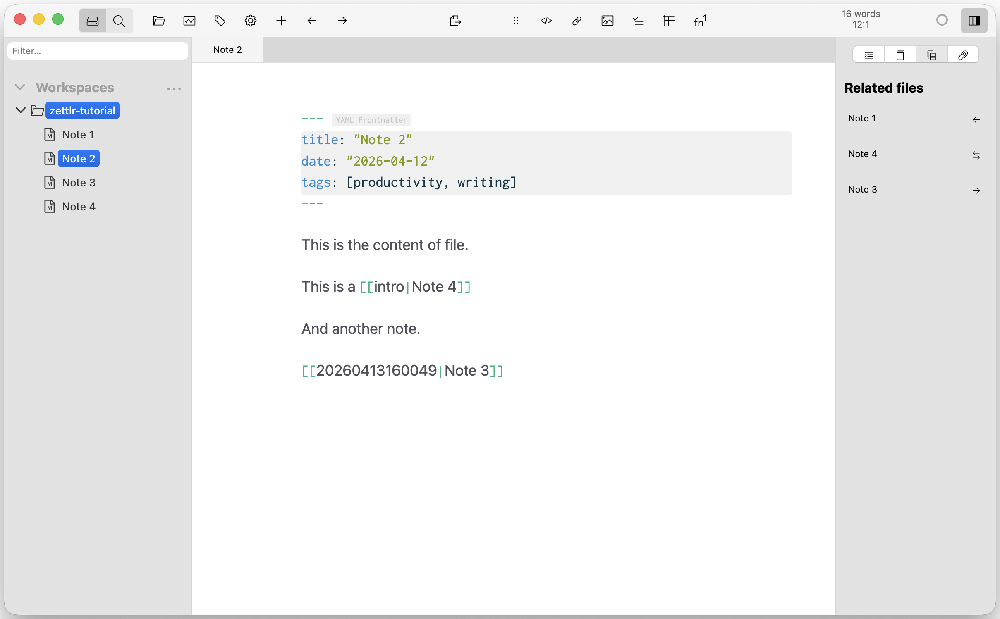

Zettlr is a Markdown editor designed for academic writing and knowledge management. It combines a clean writing environment with features borrowed from the Zettelkasten method (note linking, tags, backlinks, and full-text search) without requiring you to work inside a code editor or manage a programming environment. It is free, open-source, and runs on macOS, Windows, and Linux.

This post is a practical guide to Zettlr. If you want to use it with a reference manager for academic manuscripts, see [Zettlr and Zotero: a plain-text workflow for scientific writing](/notes/zettlr-zotero/).

<!-- SCREENSHOT: Zettlr website download page -->

## 1. Installing Zettlr

Download the installer from [zettlr.com](https://www.zettlr.com). Zettlr runs on macOS, Windows, and Linux. Install it as you would any other application.

On first launch, Zettlr asks you to choose a **workspace folder**: the root directory of your note collection. Everything inside this folder is available to Zettlr; everything outside it is ignored. You can change this later under `Zettlr > Preferences > General`.

You can have multiple workspace folders and switch between them in Preferences. This is useful if you keep personal notes and work notes in separate locations.

The workspace can be any folder you like: on your local disk, in a synced folder like Dropbox or iCloud, or inside a folder tracked by Git. Because Zettlr works with plain Markdown files, your notes are not locked into any proprietary format.

## 2. The interface

Zettlr's window has three main areas.

**Left sidebar (File manager).** A tree view of your workspace folder. You can create folders and Markdown files here, rename them, and drag them to reorganise. Toggle between the file tree and a tag-based view using the icons at the sidebar header.

**Center (Editor).** The writing area. Markdown syntax is highlighted as you type, so you see bold as bold, headings as headings, and links as links. Line numbers are optional; toggle them under `View > Show Line Numbers`.

**Right sidebar (Tabs).** The inspector panel shows contextual information:

- **Metadata**: the YAML front matter of the current note
- **Table of contents**: headings extracted from the current note, navigable by clicking
- **References**: citations, when a `.bib` file is configured (see [Zettlr and Zotero](/notes/zettlr-zotero/))
- **Attachments**: files linked from the current note



The toolbar at the top provides quick access to new file, new directory, search, export, and preferences. The search bar filters files by name as you type.

## 3. Writing in Markdown

Zettlr is a Markdown editor. If you have not used Markdown before, it is a lightweight markup language: formatting is added with punctuation rather than menus. The rendered output appears in the editor as you type.

Some common patterns:

```markdown
# Heading 1
## Heading 2

**Bold text** and *italic text*

- Bullet list item
- Another item

1. Numbered list
2. Second item

[Link text](https://example.com)
```

Zettlr adds helpful editing conveniences: matching brackets and quotes are inserted automatically, list items continue when you press Enter, and tables can be edited in a grid mode.



In the screenshot, you can see the Markdown syntax in the editor, and rendered as formatted text. If you want to hide the Markdown syntax and see only the formatted output, toggle `Preferences > Editor > Markdown Rendering` to `Preview mode`.

## 4. YAML front matter

At the top of any note, a YAML block configures metadata:

```yaml
---
title: "Note Title"
date: "2026-04-12"
tags: [productivity, writing]
---
```

Zettlr reads this block and uses the `title` field to display the note's name in the file list, instead of the raw filename. The `tags` field populates the tag cloud in the sidebar view.

<!-- SCREENSHOT: A note with YAML front matter visible, showing how Zettlr displays the title from the YAML instead of the filename -->

## 5. Organising notes

Zettlr works on plain files and folders. Your organisation is your folder structure. There is no database, no proprietary format, no hidden state, just `.md` files in directories.

### Folders vs. files

A common pattern is one note per idea, stored in a folder that reflects the topic:

```
workspace/
├── methods/
│   ├── survival-analysis.md
│   └── propensity-scores.md
├── readings/
│   ├── smith2024.md
│   └── jones2024-systematic.md
└── daily/
    ├── 2026-04-10.md
    └── 2026-04-11.md
```

### The Zettelkasten method

Zettlr is built around the Zettelkasten approach to note-taking: atomic notes, unique identifiers, and links between ideas. The method itself is a topic of its own; see [Zettelkasten on Wikipedia](https://en.wikipedia.org/wiki/Zettelkasten) for the philosophy. What Zettlr provides is the mechanical layer:

- **Note IDs:** Zettlr can generate timestamp-based unique identifiers (e.g., `202604121430`) that serve as stable, portable names for notes
- **Filenames:** You can use these IDs as filenames (`202604121430.md`) or as prefixes (`202604121430 survival analysis.md`)

Whether you use IDs or descriptive filenames is a personal choice. Both work with Zettlr's linking system.



## 6. Linking between notes

The linking system is where Zettlr becomes more than a text editor.

Type `[[` to open a dropdown of all notes in your workspace. Select one to insert a link. The link syntax has two forms:

```markdown
[[note-id]]                     -- inserts the bare link
[[note-id|Display text here]]   -- inserts link with custom display text
```

Clicking a link opens that note in a new tab. This is how you build a web of connected ideas rather than a rigid hierarchy.

The **Related files** tab in the right sidebar shows every note in your workspace that links to the current one. This is useful for tracing connections: open a note and immediately see what else references it.

**Tags** are a second way to group notes. Add `#tagname` anywhere in the body text of a note. The tag appears in the sidebar cloud; clicking it filters the file list to all notes containing that tag. Tags and folders work together: tags describe properties of notes, folders describe where they live.



## 7. Searching

### Quick search

The search bar in the toolbar filters files by name as you type. Start typing and the file list narrows immediately. This is the fastest way to find a note when you roughly know its title.

### Advanced search

`Cmd/Ctrl + Shift + F` opens the full-text search dialog. You can search for exact phrases, use operators, and filter by tags:

- `survival analysis`: finds notes containing those words
- `#tagname`: finds notes with the `methods` tag
- `"propensity score"`: exact phrase match
- `survival #tagname`: both conditions combined

The results appear as a temporary list. Click any result to open that note.

## 8. Citations

Zettlr can integrate with reference managers for academic writing. When configured with a `.bib` file (see [zettlr-zotero](/notes/zettlr-zotero/)), typing `@` triggers an autocomplete dropdown of your bibliography. Selecting an entry inserts a cite key that Pandoc resolves at export time.

For the full citation workflow (Zotero, Better BibTeX, CSL styles, and Nature-style output), see [Zettlr and Zotero: a plain-text workflow for scientific writing](/notes/zettlr-zotero/).

## 9. Exporting

Zettlr is a front end for Pandoc. The export options available depend on what is installed on your system:

- **HTML**: fast, useful for previewing or sharing a readable document
- **DOCX**: for Word users, collaborators, or journal submission
- **PDF**: via LaTeX; requires a LaTeX distribution (TeX Live on macOS/Linux, MiKTeX on Windows)
- **Reveal.js**: slides generated from Markdown headings

<!-- SCREENSHOT: Export dialog showing format options with a document open -->

Custom templates control the output style. Under `Zettlr > Preferences > Export`, you can set a custom reference DOCX file for Word exports or a LaTeX preamble for PDF exports.

## 10. Tips and workflow patterns

| Situation | Approach |
|---|---|
| Daily notes | Create a `daily/` subfolder; one file per day with a date as the filename |
| Project workspace | One root workspace folder per project, or switch workspace in preferences |
| Literature notes | One note per paper, tagged by topic; link from project notes to literature notes |
| Permanent notes | Atomic ideas with unique IDs stored in a `zettel/` folder; link liberally |
| Version control | Initialise a Git repository in your workspace folder, so every note change is tracked |

Because Zettlr files are plain Markdown, a Git repository in your workspace folder tracks every change to every note. This gives you a complete history of your thinking, even for small notes.

## Summary

| Task | Action |
|---|---|
| Install | Download from zettlr.com |
| Set workspace | Choose a folder on first launch; change in Preferences |
| Write | Create a `.md` file; add YAML front matter for title and tags |
| Organise | Use folders by topic; use tags for cross-cutting concerns |
| Link | Type `[[` to link notes; check backlinks in the right sidebar |
| Find | Toolbar for quick name filter; `Cmd+Shift+F` for full-text search |
| Cite | Configure `.bib` file; `@` for autocomplete (see [Zettlr-Zotero guide](/notes/zettlr-zotero/)) |
| Export | `File > Export` to HTML, DOCX, PDF, or Reveal.js slides |

: Key actions in Zettlr {.striped .hover}

---

Zettlr files are plain text. Nothing you write is trapped in a proprietary format. If Zettlr stops being developed tomorrow, every note you have written opens in any text editor. That is worth remembering.

For the complete academic writing workflow with citations, see [Zettlr and Zotero: a plain-text workflow for scientific writing](/notes/zettlr-zotero/).

If you have any comments or questions, feel free to [reach out](mailto:tiagojacinto@med.up.pt).
